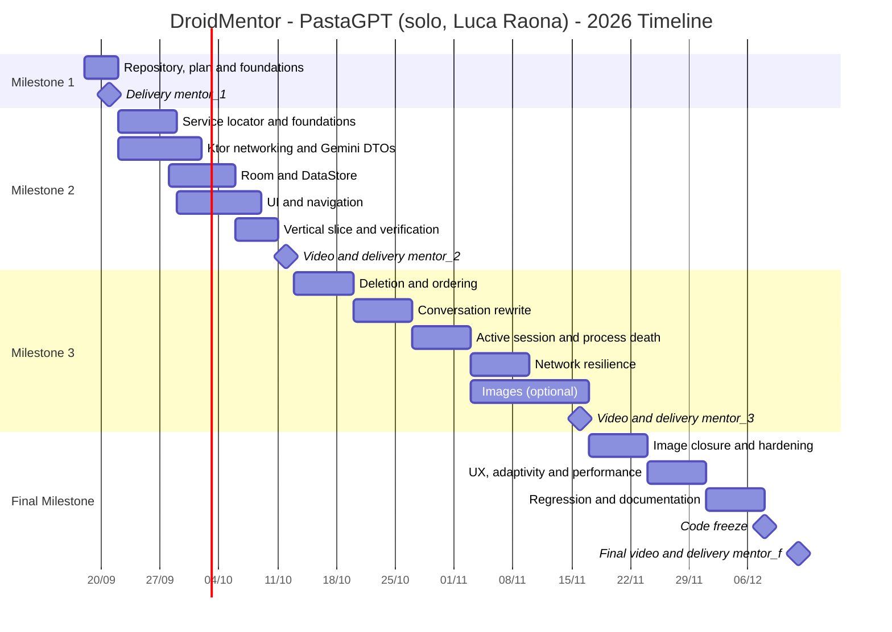

# DroidMentor — Project Plan and Timeline

**Author:** Luca Raona (student no. 55603) — solo project, name PastaGPT retained
**Course:** Mobile Devices Programming (PDM) — Instituto Superior de Engenharia de Lisboa
**Academic year:** 2026/2027 — Winter Semester
**Professors:** Prof. Paulo Pereira, Prof. Diogo Cardoso
**Final deadline:** December 12, 2026
**Document:** Milestone 1 deliverable (tag `mentor_1`)

| Version | Date | Author | Status | Notes |
|---|---|---|---|---|
| 1.0 | 18/09/2026 | Luca Raona | Approved for M1 | Initial version delivered with `mentor_1` |
| 1.1 | *(to be filled in)* | | Draft | Post-M2 revision |
| 1.2 | *(to be filled in)* | | Draft | Post-M3 revision |

> **Maintenance note.** This is a living document: at the end of every milestone the task status must be updated (`☐` → `☑`), along with actual effort and any rescheduling of unfinished tasks. The revision history is tracked in the table above and in the Git log.

---

## Table of contents

1. [Executive summary](#1-executive-summary)
2. [Author and working method](#2-author-and-working-method)
3. [Non-negotiable technical constraints](#3-non-negotiable-technical-constraints)
4. [Reference architecture](#4-reference-architecture)
5. [Working conventions and process](#5-working-conventions-and-process)
6. [Legend for estimates, priority and status](#6-legend-for-estimates-priority-and-status)
7. [Overall timeline](#7-overall-timeline)
8. [Milestone 1 — Planning and foundations (21/09/2026)](#8-milestone-1--planning-and-foundations-21092026)
9. [Milestone 2 — Working end-to-end core (12/10/2026)](#9-milestone-2--working-end-to-end-core-12102026)
10. [Milestone 3 — Advanced features and robustness (16/11/2026)](#10-milestone-3--advanced-features-and-robustness-16112026)
11. [Final Milestone — Consolidation and delivery (12/12/2026)](#11-final-milestone--consolidation-and-delivery-12122026)
12. [Verification strategy](#12-verification-strategy)
13. [Risk register](#13-risk-register)
14. [Requirements → tasks traceability matrix](#14-requirements--tasks-traceability-matrix)
15. [Appendices](#15-appendices)

---

## 1. Executive summary

DroidMentor is a **BYOK** (*Bring Your Own Key*) Android LLM client that gives the user a conversational mentor specialised in Android development. Communication goes through Gemini's REST API, `generateContent` endpoint, **in strictly stateless mode**: no server-side session identifier is allowed, so it is the application that rebuilds and transmits the entire conversation history on every single network interaction.

The application is designed as an **offline-first** experience: the local database (Room) is the single source of truth for the UI, all conversations remain readable without network access, and connectivity is checked *before* every API call, explicitly telling the user that new interactions are unavailable while offline.

The plan is organised across **four milestones** and follows an incremental life cycle with weekly sprints. The underlying strategy is **early verticalisation**: by Milestone 2 a complete vertical slice must exist (UI → ViewModel → Repository → Room + Ktor → Gemini → Room → UI), however minimal, so that the highest integration risks — stateless payload serialisation, manual service locator, consistency between network and persistence — are faced while there is still room to manoeuvre. The features with the highest logical complexity (conversation rewrite, active session restore, image attachments) are concentrated in Milestone 3, while the Final Milestone is dedicated to integration, hardening, regression testing and delivery, with a **planned code freeze on 08/12/2026** that leaves four days of slack before the deadline.

**Declared quality objectives**

| Objective | Verifiable metric |
|---|---|
| Stability | Zero crashes (ANRs/unhandled exceptions) during final regression and video recording |
| Offline-first | All conversations readable with airplane mode on; no empty or errored screens |
| Network robustness | Explicit, tested handling of 400, 401/403, 429, 5xx, timeouts, malformed responses |
| Constraint compliance | No trace of Hilt/Dagger, Retrofit, Gson/Moshi, or Base64 persisted in Room |
| Test coverage | ≥ 80 % on payload-building logic and error mapping |
| Delivery | 4 Git tags (`mentor_1`, `mentor_2`, `mentor_3`, `mentor_f`) created by their respective deadlines |

---

## 2. Author and working method

DroidMentor is a solo project: I build it, **Luca Raona** (student no. 55603), under the project name **PastaGPT**.

**Organising the work.** The WBS tables below group tasks by technical area (Networking, Persistence, UI, Connectivity, Verification, Delivery) — a thematic grouping to navigate the work, not an assignment to different people. A task that touches more than one area at once gets handled in a single sitting, without breaking it up midway, so the reasoning stays coherent start to finish.

**Verification method.** For the highest-risk tasks (marked 🔴 in §6), I write the tests before the implementation, not after — it's the most reliable way not to discover a conceptual error halfway through. For every pull request, I re-read the diff in full the day after writing it, not right away — after a few hours' distance you notice mistakes that stay invisible in the moment.

**Risk management.** The code-freeze buffer (§7, §13) is not extra time for new features: it's the reserve for something going wrong — an illness, another exam landing at the same time — because there's no one else who can absorb a delay on my behalf.

**Working cadence**

| Ceremony | Cadence | Duration | Content |
|---|---|---|---|
| Sprint planning | Monday | 15 min | Pick this sprint's tasks from the WBS, confirm the estimate still looks right |
| Progress log | Wed./Fri. | 5 min | One written line: done / in progress / blocked — useful raw material for the milestone video script later |
| Self-review + retrospective | Sunday | 30 min | Re-read the week's diffs cold, check them against the Definition of Done, adjust next week's plan |
| Milestone review | End of milestone | 60 min | Run the acceptance checklist end to end, record the video, tag |

---

## 3. Non-negotiable technical constraints

These constraints come directly from the assignment statement and act as a **cross-cutting acceptance criterion**: violating them invalidates the delivery regardless of how good the functional result is. Every pull request must be checked against this table.

| # | Constraint | Implementation implication | Anti-patterns to avoid | Tasks addressing it |
|---|---|---|---|---|
| V1 | **Manual dependency injection** through the `Application` class used as a *service locator*. Hilt/Dagger **forbidden**. | `DroidMentorApplication` exposes the singletons (database, DataStore, `HttpClient`, repositories) with *lazy* initialisation. ViewModels are created with hand-written `ViewModelProvider.Factory` (`viewModelFactory { initializer { … } }`). | Any `@HiltAndroidApp`, `@Inject`, `@Module`, `@Provides` annotation; Hilt KSP plugin in `build.gradle.kts`. | M2-01, M2-02 |
| V2 | **Networking exclusively with Ktor Client + Kotlinx Serialization.** | `ContentNegotiation` plugin with `Json { ignoreUnknownKeys = true }`; DTOs annotated `@Serializable`; OkHttp or CIO engine. | Retrofit, Volley, `HttpURLConnection`, Gson, Moshi, Jackson. | M2-05, M2-06, M2-07 |
| V3 | **Chat persistence with Room.** | `chats` and `messages` entities with a foreign key and `onDelete = CASCADE`; DAOs exposing `Flow`; exported and version-controlled schema. | Storing history in `SharedPreferences`, in JSON files, or only in memory. | M2-11, M2-12, M2-13 |
| V4 | **BYOK API key stored with DataStore.** | Dedicated `Preferences DataStore`, separate from any UI preferences; exposed as `Flow<String?>`; must be erasable. | Key in `SharedPreferences`, in Room, in a source constant, in a committed `local.properties`, in `BuildConfig`. | M2-14, MF-06 |
| V5 | **Mandatory stateless mode.** Server-side multi-turn session IDs are forbidden. | Every request carries the full `contents` array with strict alternation of `user` / `model` roles. Conversational state lives **only** in Room. | Using stateful APIs or endpoints (e.g. persistent sessions or *interaction ids*); storing a `conversationId` returned by the service. | M2-08, M2-15 |
| V6 | **Persona set via `system_instruction`.** | The `system_instruction` field is present in every request, with the text centralised in a single constant. No RAG or advanced prompt-engineering techniques are required. | Injecting the persona as the first `user` message of the `contents` array. | M2-10 |
| V7 | **Offline-first experience.** | Room is the single source of truth for the UI; connectivity is checked *before* the call; an explicit message is shown when offline. | Screens that depend on a network response to populate; silent `try/catch` that leaves the UI blank. | M2-15, M2-23, M2-24 |
| V8 | **Graceful HTTP error handling** (e.g. 429, 500). | Typed `sealed interface` mapping of outcomes; no exception propagated to the UI; understandable user feedback. | Crashing on `ClientRequestException`; raw technical messages shown to the user. | M2-09, M3-08, M3-09 |
| V9 | **Images (optional, valued requirement):** only the **file URI/path** is persisted in Room. | Files stored in the app's local storage; Base64 `inline_data` encoding built **in memory** only at request time and never written to the database. | A `TEXT` column holding the Base64 string; a `BLOB` with the image bytes. | M3-11 … M3-15 |
| V10 | **Deliveries via Git tags** `mentor_X` on the repository, with full access granted to the professors and a root `README.md` identifying you. | Annotated tags pushed to the remote; README updated at every milestone with the video link. | Lightweight tags created locally and never pushed; missing or incomplete README. | M1-01, M1-02, M1-09, M2-31, M3-18, MF-11 |

---

## 4. Reference architecture

### 4.1 Layering

Three-layer architecture with unidirectional data flow (UDF), without any DI framework.

```
┌──────────────────────────────────────────────────────────────────┐
│  UI  (Jetpack Compose + Navigation)                              │
│  TitleScreen · ChatHistoryScreen · ActiveChatScreen              │
│  AboutScreen · SettingsScreen                                    │
│        ▲ UiState (StateFlow)          │ user events              │
├────────┴───────────────────────────────▼─────────────────────────┤
│  PRESENTATION  ViewModel + immutable UiState                     │
│  created by hand-written ViewModelProvider.Factory               │
├──────────────────────────────────────────────────────────────────┤
│  DOMAIN  Chat · Message · Role · HistoryPayloadBuilder           │
│          (pure Kotlin, no Android dependencies)                  │
├──────────────────────────────────────────────────────────────────┤
│  DATA                                                            │
│   ChatRepository ──► Room (SINGLE SOURCE OF TRUTH)               │
│        │                                                         │
│        └──────────► GeminiRemoteDataSource (Ktor)                │
│   SettingsRepository ──► DataStore (BYOK key)                    │
│   ConnectivityObserver ──► ConnectivityManager                   │
├──────────────────────────────────────────────────────────────────┤
│  DroidMentorApplication  ← SERVICE LOCATOR (lazy singletons)     │
└──────────────────────────────────────────────────────────────────┘
```

### 4.2 Core principle: Room as the source of truth

The UI **never observes** a network call result directly. The cycle is:

1. The user sends a message → the repository immediately inserts it into Room with status `SENDING`.
2. The DAO's `Flow` notifies the UI, which displays the message right away (*optimistic update*).
3. The repository checks connectivity, builds the payload with **all** the history and calls Gemini.
4. The outcome is written to Room: the model's reply as a new row with role `MODEL`, or the message updated to status `FAILED`.
5. The UI updates again by observing Room only.

This choice satisfies V3, V5 and V7 simultaneously and makes the offline-reading requirement trivial.

### 4.3 Technology stack

| Area | Choice | Rationale |
|---|---|---|
| Language | Kotlin + Coroutines/Flow | Course standard; structured concurrency |
| UI | Jetpack Compose + Material 3 | Declarative, aligned with modern practices |
| Navigation | Navigation Compose with typed routes | Explicit graph, deep link to Settings |
| Networking | **Ktor Client** (OkHttp engine) | Constraint V2 |
| Serialisation | **Kotlinx Serialization** | Constraint V2 |
| Persistence | **Room** | Constraint V3 |
| Preferences/secrets | **DataStore (Preferences)** | Constraint V4 |
| Images | Coil (rendering only) | Asynchronous loading from a local URI |
| Testing | JUnit 4, `kotlinx-coroutines-test`, Ktor `MockEngine`, in-memory Room, Compose UI Test | Coverage across all three levels of the pyramid |
| CI | GitHub Actions | Automatic build and tests on every PR |

### 4.4 Project configuration

| Parameter | Value | Note |
|---|---|---|
| `minSdk` | 26 | Enables `java.time` and modern storage APIs |
| `targetSdk` / `compileSdk` | Latest stable available | To be pinned in `libs.versions.toml` |
| Modules | Single `:app` module with per-layer packages | Modularisation is not required; avoids unnecessary complexity |
| Permissions | `INTERNET`, `ACCESS_NETWORK_STATE`, `CAMERA` (only if the optional requirement is implemented) | No storage permission needed thanks to the Photo Picker |

---

## 5. Working conventions and process

### 5.1 Repository and branching

- **Repository:** `pastagpt-droidmentor` (private), with full access granted to Prof. Paulo Pereira and Prof. Diogo Cardoso.
- **Model:** *trunk-based* with short-lived branches. `main` is always buildable and green in CI.
- **Branch naming:** `feat/<task-id>-<slug>`, `fix/<slug>`, `docs/<slug>`, `chore/<slug>`.
  Example: `feat/m2-08-history-payload-builder`.
- **Commits:** Conventional Commits (`feat:`, `fix:`, `refactor:`, `test:`, `docs:`, `chore:`), message in English, task reference in the body.
- **Pull requests:** used as a self-review checkpoint even solo — open a PR from the feature branch, let the constraint checklist template run against it, and merge only after re-reading the diff once yourself, ideally the next day. Recommended maximum PR size: ~400 changed lines.
- **Tags:** annotated and explicitly pushed.
  ```bash
  git tag -a mentor_1 -m "Milestone 1 - Project plan"
  git push origin mentor_1
  ```

### 5.2 Definition of Done (per task)

A task is *Done* only if all of the following hold:

- ☐ The code compiles with no new warnings and passes `./gradlew lint`.
- ☐ The tests required by the verification strategy for that level are in place.
- ☐ The full suite (`./gradlew test connectedAndroidTest`) is green locally and in CI.
- ☐ The diff has been re-read in full, after a break, before merging (see §2 on self-review).
- ☐ No constraint from section 3 has been violated (explicitly checked during review).
- ☐ No secret, key or token has reached the repository or the logs.
- ☐ The affected documentation (README, ADR, this plan) is updated in the same commit.

### 5.3 Definition of Done (per milestone)

- ☐ All planned tasks are *Done* or formally rescheduled with a written justification.
- ☐ The application installs and is usable on a physical device and on an emulator.
- ☐ The video (where required) is **5–7 minutes** long and covers every required point.
- ☐ The root `README.md` contains your identification and the video link.
- ☐ The `mentor_X` tag is created **and pushed** by the deadline.
- ☐ The milestone's acceptance checklist is filled in within this document.

---

## 6. Legend for estimates, priority and status

**Difficulty**

| Symbol | Level | Operational meaning |
|---|---|---|
| 🟢 | Low | Straightforward work, well-known APIs, negligible technical risk. Can be done solo. |
| 🟡 | Medium | Requires design work or integration across several components. Careful review advised. |
| 🔴 | High | Critical logic, high risk of regression or conceptual error. **Tests written before the implementation are mandatory** (the solo substitute for pair programming — see §2). |

**Priority**

| Code | Meaning |
|---|---|
| **M** | *Must* — explicit requirement of the statement: its absence compromises the grade |
| **S** | *Should* — expected quality, strongly recommended |
| **C** | *Could* — valued optional requirement or improvement |

**Estimate:** expressed in **ideal person-hours** (actual focused work, interruptions excluded). Recommended conservative conversion factor: **1 ideal hour ≈ 1.4 calendar hours**.

**Status:** `☐` to do · `◐` in progress · `☑` done · `⊘` rescheduled.

---

## 7. Overall timeline

| Phase | Period | Sprints | Focus | Estimated ideal hours |
|---|---|---|---|---|
| **Milestone 1** | 18/09 → **21/09/2026** | Sprint 0 | Planning, repository, project foundations | ~11 h |
| **Milestone 2** | 22/09 → **12/10/2026** | Sprints 1–3 | Architecture, stateless networking, persistence, complete vertical slice, verification strategy | ~92 h |
| **Milestone 3** | 13/10 → **16/11/2026** | Sprints 4–8 | Deletion, conversation rewrite, active session, resilience, images | ~83 h |
| **Final Milestone** | 17/11 → **12/12/2026** | Sprints 9–12 | Integration, hardening, UX, regression, delivery | ~62 h |
| | | | **Total** | **~248 h, all solo** (~21 ideal h/week over 12 weeks ≈ 29 calendar h/week at the 1.4× factor) |

> **Workload check.** 248 ideal hours solo over the ~12 weeks to 12/12/2026 is about 21 ideal hours a week — roughly 29 calendar hours a week once the 1.4× factor from §6 is applied. That is a substantial load on top of whatever else is running this semester, and it is not evenly spread: Milestone 2 alone is heavier than this average (see its own total below). If the pace does not hold against your real timetable, the place to cut is the *Could* tasks (the optional image requirement, M3-11…M3-15, MF-01) and the *Should* tasks, not the *Must* ones — see §13, risk R4.

### 7.1 Sprint goals

| Sprint | Week | Verifiable goal by end of sprint |
|---|---|---|
| **0** | 18–21/09 | Repository operational, plan approved, `mentor_1` tag pushed |
| **1** | 22–28/09 | Android project builds with all dependencies; service locator working; Gemini DTOs serialise/deserialise correctly under test |
| **2** | 29/09–05/10 | Room + DataStore operational; navigation across the 5 screens; Settings saves and reads back the key |
| **3** | 06–12/10 | **Complete vertical slice:** send message → model reply → persistence → offline re-read. M2 video recorded, `mentor_2` tag |
| **4** | 13–19/10 | Conversation deletion with CASCADE; deterministic message ordering |
| **5** | 20–26/10 | Conversation rewrite working end-to-end (truncation + resend) |
| **6** | 27/10–02/11 | Active session restored at launch; survival across process death |
| **7** | 03–09/11 | Network resilience: retry with backoff, per-message status, "Retry" action |
| **8** | 10–16/11 | Optional image requirement in a demonstrable state. M3 video, `mentor_3` tag |
| **9** | 17–23/11 | Image requirement closed, file life cycle, error hardening |
| **10** | 24–30/11 | UX review, adaptivity, accessibility, performance |
| **11** | 01–07/12 | Full regression across the device matrix; final documentation |
| **12** | 08–12/12 | **Code freeze 08/12.** Critical bugfixes only. Final video, release build, `mentor_f` tag |

### 7.2 Gantt chart



---

## 8. Milestone 1 — Planning and foundations (21/09/2026)

> **Week 3 of the semester. Effective window: 4 days.**

### 8.1 Goal

Deliver the project plan required by the statement and set up the working infrastructure. Tasks marked *(pulled forward from M2)* are not required by the Milestone 1 acceptance criteria, but should be done now because they remove friction at the start of Sprint 1: creating the Gradle project skeleton the day before the first feature is the most common cause of slippage in the opening weeks.

### 8.2 WBS — Work Breakdown Structure

| ID | Task | Operational description | Pri. | Diff. | Est. | Dep. | Status |
|---|---|---|---|---|---|---|---|
| M1-01 | Repository creation | GitHub repo `pastagpt-droidmentor`, private. Invite Prof. Paulo Pereira and Prof. Diogo Cardoso with **full access**. `.gitignore` for Android/Kotlin/IDEA. | M | 🟢 | 0.5 h | — | ☑ |
| M1-02 | Root `README.md` | Your identification: full name, student number, institutional email, GitHub handle. Project title and course reference. Placeholders for the milestone video links. | M | 🟢 | 0.5 h | M1-01 | ☑ |
| M1-03 | Project plan | Writing and review of this document (`PROJECT_PLAN.md`), with timeline, tasks and acceptance criteria. The statement also asks for "to whom" tasks are assigned: for a solo project that's implicit — every task is mine. Prominent link from the README. | M | 🟡 | 3 h | M1-01 | ☑ |
| M1-04 | Working conventions | `CONTRIBUTING.md` with branching, commit conventions, review policy. `.github/pull_request_template.md` with the section 3 constraint checklist. `CODEOWNERS`. | S | 🟢 | 1 h | M1-01 | ☑ |
| M1-05 | Project board | GitHub Projects with *Backlog / Sprint / In review / Done* columns. Import the tasks from this plan as issues, labelled by milestone and difficulty. | S | 🟢 | 1 h | M1-03 | ⊘ |
| M1-06 | Project scaffolding *(pulled forward from M2)* | Android Studio project: Kotlin, Compose, `minSdk 26`, package `pt.isel.pdm.droidmentor`. Verify the empty app launches on an emulator. | S | 🟡 | 2 h | M1-01 | ☑ |
| M1-07 | Version catalog *(pulled forward from M2)* | `gradle/libs.versions.toml` with Compose BOM, Navigation, Ktor (core, engine, content-negotiation, logging), kotlinx-serialization, Room (runtime, ktx, KSP compiler), DataStore Preferences, Coil, test libraries. Successful Gradle sync. | S | 🟡 | 1.5 h | M1-06 | ☑ |
| M1-08 | Gemini key provisioning | One API key from Google AI Studio (ideally a second, spare one from a different account). Check the free-tier limits and note the quotas (relevant for testing the HTTP 429 path). **No key committed.** | M | 🟢 | 0.5 h | — | ☑ |
| M1-09 | `mentor_1` tag | Final commit, annotated tag, tag push. Verify on GitHub that the tag is visible and that the professors have access. | M | 🟢 | 0.25 h | M1-02, M1-03 | ☑ |

**Estimated total:** ~10.25 ideal hours.

### 8.3 Acceptance checklist (Milestone 1)

Derived literally from the statement's *Acceptance criteria*:

- ☑ The repository is correctly tagged **`mentor_1`** and the tag has been pushed to the remote.
- ☑ The repository contains the **project plan timeline** indicating the planned tasks (the assignment the statement asks for is implicit: solo project, every task is mine).
- ☑ The **root `README.md`** contains your identification.
- ☐ Both professors have **full access** to the repository (verify in *Settings → Collaborators*).
- ☑ The `[email]` and `[@handle]` placeholders in the README template (Appendix C) have been replaced with your real details.

### 8.4 Milestone-specific risks

| Risk | Mitigation |
|---|---|
| A window of only 4 days | Absolute priority to M1-01, M1-02, M1-03, M1-09: they are the only graded tasks. Scaffolding can slip into Sprint 1 with no impact on the grade. |
| Professor invitations not accepted in time | Send the invitations on **day one** and check their status before tagging; record the invitation date in the README. |

---

## 9. Milestone 2 — Working end-to-end core (12/10/2026)

> **Week 6 of the semester. 3 weeks, Sprints 1–3.**

### 9.1 Goal

Build the entire architectural scaffolding and reach a **demonstrable vertical slice**: the user configures their key, opens a new conversation, sends a message, receives the mentor's reply, closes the app, enables airplane mode and reads the conversation back. All the technical constraints from section 3 must already be in force at this stage, because retrofitting a dependency-injection or serialisation decision later costs disproportionately more.

Pay particular attention to the fact that Milestone 2 explicitly requires the video to contain a **description of the elected verification strategy**: the workstream F tasks are neither optional nor deferrable.

### 9.2 WBS — Workstream A: Foundations and manual dependency injection

| ID | Task | Operational description | Pri. | Diff. | Est. | Dep. | Status |
|---|---|---|---|---|---|---|---|
| M2-01 | Service locator | `DroidMentorApplication : Application` exposing, via `by lazy`, the Room database, DataStore, the Ktor `HttpClient` and the repositories. Extension `val Context.app: DroidMentorApplication`. **No trace of Hilt/Dagger (V1).** | M | 🟡 | 4 h | M1-07 | ☐ |
| M2-02 | ViewModel factories | A `DependencyContainer` interface implemented by the `Application`, so it can be swapped for a fake in tests. `ViewModelProvider.Factory` built with `viewModelFactory { initializer { … } }`. | M | 🟡 | 3 h | M2-01 | ☐ |
| M2-03 | Package structure and design system | Packages `data/{local,remote,repository}`, `domain`, `ui/{screens,components,theme,navigation}`. Material 3 theme, palette, typography, spacing, light/dark support. | S | 🟢 | 2 h | M1-06 | ☐ |
| M2-04 | Domain model | `Chat(id, title, createdAt, updatedAt)`, `Message(id, chatId, role, text, imagePath?, seq, status, createdAt)`, `enum Role { USER, MODEL }`, `enum MessageStatus { SENDING, SENT, FAILED }`. Pure Kotlin, no Android dependencies. | M | 🟢 | 2 h | — | ☐ |

### 9.3 WBS — Workstream B: Networking (Ktor + Kotlinx Serialization)

| ID | Task | Operational description | Pri. | Diff. | Est. | Dep. | Status |
|---|---|---|---|---|---|---|---|
| M2-05 | `HttpClient` configuration | OkHttp engine; `ContentNegotiation` with `Json { ignoreUnknownKeys = true; explicitNulls = false }`; `HttpTimeout` (connect 10 s, socket 60 s); `DefaultRequest` with base URL `https://generativelanguage.googleapis.com/`; `Logging` plugin **enabled in debug only** and configured not to print headers or bodies containing the key. | M | 🟡 | 3 h | M2-01 | ☐ |
| M2-06 | Gemini DTOs | `@Serializable` types for `GenerateContentRequest(systemInstruction, contents, generationConfig)`, `Content(role, parts)`, `Part(text, inlineData?)`, `GenerateContentResponse(candidates, usageMetadata)`, `Candidate(content, finishReason)`, `ApiErrorEnvelope(error)`. Use `@SerialName` for snake_case fields (e.g. `system_instruction`, `inline_data`, `mime_type`). | M | 🟡 | 4 h | M2-05 | ☐ |
| M2-07 | `GeminiRemoteDataSource` | `suspend fun generateContent(history, systemInstruction, apiKey): ApiResult<String>`. `POST /v1beta/models/{model}:generateContent` with the `x-goog-api-key` header. Model name configurable from a single constant. **No session identifier (V5).** | M | 🔴 | 5 h | M2-06 | ☐ |
| M2-08 | `HistoryPayloadBuilder` | Pure domain component that turns `List<Message>` into `List<Content>` guaranteeing: strict `user`/`model` alternation, exclusion of `FAILED` messages, configurable truncation of the oldest turns to contain token cost, order preserved via `seq`. **The heart of the stateless requirement: must be exhaustively tested.** | M | 🔴 | 5 h | M2-04 | ☐ |
| M2-09 | Error mapping | `sealed interface ApiResult<out T>` with `Success`, `InvalidApiKey` (401/403), `BadRequest` (400), `RateLimited(retryAfterSeconds)` (429), `ServerError` (5xx), `NetworkUnavailable` (`IOException`), `MalformedResponse` (`SerializationException`), `Unknown`. No exception escapes the data source (V8). | M | 🟡 | 4 h | M2-07 | ☐ |
| M2-10 | Persona `system_instruction` | A single text defining the senior Android mentor: tone, scope of expertise, preference for official best practices, request for Kotlin examples. Centralised in `MentorPersona.kt` (V6). | M | 🟢 | 1 h | M2-06 | ☐ |

### 9.4 WBS — Workstream C: Persistence (Room + DataStore)

| ID | Task | Operational description | Pri. | Diff. | Est. | Dep. | Status |
|---|---|---|---|---|---|---|---|
| M2-11 | Room entities | `ChatEntity(id, title, createdAt, updatedAt)` and `MessageEntity(id, chatId, role, text, imagePath, seq, status, createdAt)` with `@ForeignKey(onDelete = CASCADE)` and `@Index("chatId")`. Type converters for the enums. | M | 🟡 | 4 h | M2-04 | ☐ |
| M2-12 | DAOs | `ChatDao`: `observeChats(): Flow<List<ChatWithLastMessage>>`, `insert`, `updateTitle`, `deleteById`. `MessageDao`: `observeMessages(chatId): Flow<List<MessageEntity>>`, `insert`, `updateStatus`, `deleteFromSeq(chatId, seq)`, `nextSeq(chatId)`. Relation queries with `@Transaction` + `@Relation`. | M | 🟡 | 4 h | M2-11 | ☐ |
| M2-13 | Database | `DroidMentorDatabase : RoomDatabase` version 1, schema exported to `app/schemas` and **version-controlled in Git** (essential for testing later migrations). | M | 🟢 | 2 h | M2-12 | ☐ |
| M2-14 | `SettingsRepository` | Dedicated Preferences DataStore: `apiKey: Flow<String?>`, `saveApiKey`, `clearApiKey`. The key is never logged nor included in crash reports (V4). | M | 🟡 | 3 h | M2-01 | ☐ |
| M2-15 | Offline-first `ChatRepository` | Orchestration of the cycle described in §4.2: optimistic insert, connectivity check, payload construction, call, outcome write. The UI observes **only** Room (V7). | M | 🔴 | 5 h | M2-09, M2-12, M2-23 | ☐ |

### 9.5 WBS — Workstream D: User interface and navigation

| ID | Task | Operational description | Pri. | Diff. | Est. | Dep. | Status |
|---|---|---|---|---|---|---|---|
| M2-16 | Navigation graph | `NavHost` with routes `Title`, `ChatHistory`, `ActiveChat/{chatId}`, `About`, `Settings`, matching Figure 1 of the statement (including the return paths). Back stack management. | M | 🟡 | 4 h | M2-03 | ☐ |
| M2-17 | Title Screen | Main menu: logo/title, entries *Conversations*, *Settings*, *About*. Entry point of the app when no active chat exists. | M | 🟢 | 2 h | M2-16 | ☐ |
| M2-18 | About Screen | Application name, version, your name, course and institution, third-party library credits. | M | 🟢 | 1.5 h | M2-16 | ☐ |
| M2-19 | Settings Screen | API key field with `PasswordVisualTransformation` and a visibility toggle, save, clear, *key configured / not configured* indicator, non-empty format validation, snackbar feedback. | M | 🟡 | 4 h | M2-14, M2-16 | ☐ |
| M2-20 | Chat History Screen | `LazyColumn` fed by the Room `Flow`: title, last-message preview, relative date. Illustrated empty state. FAB *New conversation*. | M | 🟡 | 4 h | M2-12, M2-16 | ☐ |
| M2-21 | Active Chat Screen | Message list with role-differentiated bubbles, input bar with send, auto-scroll to the latest message, *the mentor is typing* indicator, correct `imePadding` handling. | M | 🔴 | 6 h | M2-15, M2-16 | ☐ |
| M2-22 | ViewModels and UiState | One ViewModel per screen with an immutable `UiState` exposed as `StateFlow`; one-shot events (snackbar, navigation) via `Channel`/`SharedFlow`. No business logic inside Composables. | M | 🟡 | 4 h | M2-02, M2-15 | ☐ |

### 9.6 WBS — Workstream E: Connectivity

| ID | Task | Operational description | Pri. | Diff. | Est. | Dep. | Status |
|---|---|---|---|---|---|---|---|
| M2-23 | `ConnectivityObserver` | Wrapper over `ConnectivityManager.registerNetworkCallback` exposed as `Flow<ConnectivityStatus>`, checking `NET_CAPABILITY_VALIDATED`. Registered in the service locator. | M | 🟡 | 3 h | M2-01 | ☐ |
| M2-24 | Offline gating | Connectivity is checked **before** every call (V7). When offline: send input disabled, persistent and understandable banner at the top of the Active Chat, history still fully readable. | M | 🟡 | 3 h | M2-21, M2-23 | ☐ |

### 9.7 WBS — Workstream F: Verification *(explicitly required in the M2 video)*

| ID | Task | Operational description | Pri. | Diff. | Est. | Dep. | Status |
|---|---|---|---|---|---|---|---|
| M2-25 | `VERIFICATION.md` document | Formalisation of the strategy described in section 12: levels, tools, exit criteria, device matrix. It is the source from which the verification part of the video is built. | M | 🟡 | 2 h | — | ☐ |
| M2-26 | `HistoryPayloadBuilder` tests | Cases: empty conversation, single turn, N alternating turns, `FAILED` messages excluded, truncation beyond threshold, absence of any session identifier in the produced payload. | M | 🟡 | 3 h | M2-08 | ☐ |
| M2-27 | Network tests with `MockEngine` | Simulation of 200 with a valid payload, 400, 401, 429 with a `Retry-After` header, 500, malformed JSON, timeout. Verify the mapping onto `ApiResult` and that no exception propagates. | M | 🟡 | 4 h | M2-09 | ☐ |
| M2-28 | Instrumented DAO tests | In-memory Room: inserts, `Flow` observation, cascade deletion, `seq` monotonicity. | M | 🟡 | 3 h | M2-12 | ☐ |
| M2-29 | Continuous Integration | GitHub Actions workflow on `push` and `pull_request`: `assembleDebug`, `testDebugUnitTest`, `lint`. Status badge in the README. | S | 🟡 | 2 h | M1-07 | ☐ |

### 9.8 WBS — Workstream G: Delivery

| ID | Task | Operational description | Pri. | Diff. | Est. | Dep. | Status |
|---|---|---|---|---|---|---|---|
| M2-30 | Milestone 2 video | **5–7 minute** recording following the Appendix D script: demonstration of the implemented functionalities, discussion of the most relevant decisions (manual service locator, stateless design, offline-first), **description of the verification strategy**, current project status. Upload to a platform with a stable link, access verified in a private browsing window. | M | 🟡 | 4 h | all M2 | ☐ |
| M2-31 | `mentor_2` tag | Add the video link to the `README.md`, commit, annotated tag, push. | M | 🟢 | 0.5 h | M2-30 | ☐ |

**Estimated Milestone 2 total:** ~92 ideal hours, all solo — about 31 ideal hours a week over the 3 weeks (≈43 calendar hours a week at the 1.4× factor). This is the heaviest sprint block in the whole plan; see the workload note in §7.

### 9.9 Acceptance checklist (Milestone 2)

- ☐ The repository is correctly tagged **`mentor_2`** and the tag has been pushed.
- ☐ The `README.md` contains the **video link**, verified as reachable from an outside account.
- ☐ The video is **between 5 and 7 minutes** long.
- ☐ The video **demonstrates the implemented functionalities**.
- ☐ The video **discusses the most relevant decisions**.
- ☐ The video **describes the elected verification strategy**.
- ☐ The video **presents the current status of the project**.

**Additional internal verification (not required by the statement, but necessary to avoid accumulating debt):**

- ☐ Search the whole codebase for `hilt`, `dagger`, `retrofit`, `gson`, `moshi`: **zero occurrences**.
- ☐ Inspect the payload actually sent: it contains `system_instruction` and the full `contents` array with alternating roles.
- ☐ Manual airplane-mode test: conversations remain readable and the unavailability message is clear.

---

## 10. Milestone 3 — Advanced features and robustness (16/11/2026)

> **Week 11 of the semester. 5 weeks, Sprints 4–8.**

### 10.1 Goal

Implement the requirements with the highest logical complexity — conversation deletion, **conversation rewrite**, active session restore at launch — and bring the optional image requirement to a demonstrable state. This is the milestone with the highest regression risk: every 🔴 task modifies invariants already covered by existing tests.

### 10.2 WBS — Conversation management

| ID | Task | Operational description | Pri. | Diff. | Est. | Dep. | Status |
|---|---|---|---|---|---|---|---|
| M3-01 | Conversation deletion | Swipe gesture and/or context menu in the Chat History, confirmation dialog, deletion with `CASCADE` over the messages, snackbar with an *Undo* action (5 s window before the associated files are actually deleted). | M | 🟡 | 4 h | M2-12, M2-20 | ☐ |
| M3-02 | Conversation titling | Title generated automatically from the first characters of the first user message, with manual rename available. | S | 🟢 | 2 h | M3-01 | ☐ |
| M3-03 | **Conversation rewrite** | The user edits one of their own messages at **any position**. Atomic Room transaction: update the text, `deleteFromSeq(chatId, seq + 1)` which invalidates and removes all subsequent exchanges, rebuild the payload over the truncated history and resend it to the API. If the network call fails, the state prior to the resend must remain consistent. | M | 🔴 | 8 h | M2-15, M3-05 | ☐ |
| M3-04 | Rewrite UI | Long-press on a user bubble → context menu (*Edit*, *Copy*, *Delete*). In edit mode: dialog or pre-filled input bar with an explicit warning that subsequent messages will be deleted; confirmation required. | M | 🔴 | 5 h | M3-03 | ☐ |
| M3-05 | Deterministic ordering | Introduce a monotonic per-chat `seq` field, populated inside a transaction. **Do not rely on timestamps**: two messages inserted in the same millisecond would make the ordering non-deterministic and corrupt the role alternation in the payload. Room migration 1 → 2 with tests. | M | 🟡 | 3 h | M2-13 | ☐ |

### 10.3 WBS — State management and life cycle

| ID | Task | Operational description | Pri. | Diff. | Est. | Dep. | Status |
|---|---|---|---|---|---|---|---|
| M3-06 | Active session restore | `activeChatId` saved in DataStore on entering the Active Chat and **cleared only** on explicit exit (back, closing the conversation). At launch, conditional routing: if present → Active Chat, otherwise → Title. Implements the statement's semantics ("*a user is considered previously engaged if they did not explicitly close or navigate away from the active conversation before the application was terminated*"). | M | 🔴 | 5 h | M2-14, M2-16 | ☐ |
| M3-07 | Surviving process death | `SavedStateHandle` for the unsent draft text and the scroll position. Verified with the *Don't keep activities* option and with `adb shell am kill`. | S | 🟡 | 4 h | M2-22 | ☐ |
| M3-08 | Retry policy | Exponential backoff with jitter for 429 and 503, reading the `Retry-After` header when present, at most 3 attempts, user-cancellable operation, no retry on 400/401/403. | M | 🔴 | 5 h | M2-09 | ☐ |
| M3-09 | Per-message status | Differentiated rendering for `SENDING` (progress indicator), `SENT`, `FAILED` (icon + *Retry* action on the bubble). Resending reuses the payload rebuilt from the current history. | M | 🟡 | 4 h | M3-08 | ☐ |
| M3-10 | Missing or invalid key | If the key is absent or the API returns 401/403: contextual message with a direct action leading to the Settings screen, no dead ends. | M | 🟡 | 3 h | M2-19, M2-09 | ☐ |

### 10.4 WBS — Optional requirement: images in the conversation

> **Optional but valued** requirement. Start it only if the milestone's *Must* tasks are well advanced by Sprint 6. Constraint V9 is absolute.

| ID | Task | Operational description | Pri. | Diff. | Est. | Dep. | Status |
|---|---|---|---|---|---|---|---|
| M3-11 | Gallery selection | `ActivityResultContracts.PickVisualMedia` (Photo Picker): requires no runtime permission. Copy the selected file into `filesDir/images/` with a unique name. | C | 🟡 | 4 h | M2-21 | ☐ |
| M3-12 | Camera capture | `ActivityResultContracts.TakePicture` with a `FileProvider` configured in `file_paths.xml`; handling of the `CAMERA` permission with its rationale and of permanent denial. | C | 🔴 | 6 h | M3-11 | ☐ |
| M3-13 | Constraint-compliant persistence | An `imagePath` column (**relative** path, to survive sandbox changes) in `messages`. Room migration 2 → 3. The `inline_data` Base64 encoding is produced **in memory** only when building the request and is **never** written to the database (V9). | C | 🔴 | 5 h | M3-11, M2-08 | ☐ |
| M3-14 | Rendering in the conversation | Thumbnail inside the bubble with Coil, loading placeholder, handling of the *file no longer present* case, full-screen viewer. | C | 🟡 | 4 h | M3-13 | ☐ |
| M3-15 | File life cycle | Delete the file when the message or the conversation is deleted; delete on a rewrite that invalidates the message; orphan-cleanup routine at startup; resize/compress before sending to keep the payload small. | C | 🟡 | 4 h | M3-13, M3-01 | ☐ |

### 10.5 WBS — Quality and delivery

| ID | Task | Operational description | Pri. | Diff. | Est. | Dep. | Status |
|---|---|---|---|---|---|---|---|
| M3-16 | Accessibility and UI polish | `contentDescription` on every non-textual element, touch targets ≥ 48 dp, verified contrast, complete dark theme, correct behaviour on rotation. | S | 🟡 | 4 h | M2-21 | ☐ |
| M3-17 | Test suite extension | Tests for the rewrite (correct truncation, resulting payload), for retries, for Room migrations 1→2→3, Compose UI tests over the main flows. | M | 🟡 | 5 h | M3-03, M3-08 | ☐ |
| M3-18 | Milestone 3 video | **5–7 minute** recording: demonstration of the functionalities (with emphasis on rewrite, deletion, session restore, images if present), discussion of the relevant decisions, project status. | M | 🟡 | 4 h | all M3 | ☐ |
| M3-19 | `mentor_3` tag | Video link in the `README.md`, commit, annotated tag, push. | M | 🟢 | 0.5 h | M3-18 | ☐ |

**Estimated Milestone 3 total:** ~83 ideal hours, all solo — about 17 ideal hours a week over the 5 weeks (≈23 calendar hours a week at the 1.4× factor).

### 10.6 Acceptance checklist (Milestone 3)

- ☐ The repository is correctly tagged **`mentor_3`** and the tag has been pushed.
- ☐ The `README.md` contains the **video link**, reachable from outside.
- ☐ The video is **between 5 and 7 minutes** long.
- ☐ The video **demonstrates the implemented functionalities**.
- ☐ The video **discusses the most relevant decisions**.
- ☐ The video **presents the current status of the project**.

**Additional internal verification:**

- ☐ Rewriting a message in an **intermediate position** correctly deletes every subsequent exchange and generates new ones.
- ☐ Closing the app from inside a conversation and reopening it returns to that conversation; exiting first with *back* returns to the Title.
- ☐ Database inspection (App Inspection): the image column holds **paths**, not Base64 strings.

---

## 11. Final Milestone — Consolidation and delivery (12/12/2026)

> **~4 weeks, Sprints 9–12. Code freeze 08/12/2026.**

### 11.1 Goal

No new functionality after Sprint 9, except completing the optional requirement. The period is dedicated to integration, hardening, refining the user experience, systematic regression testing and producing the delivery materials. The statement requires an application that is *complete and stable, with all planned screens accessible* and with *all functionality working as specified in earlier milestones*: stability is therefore an explicit grading criterion, not a side concern.

### 11.2 WBS

| ID | Task | Operational description | Pri. | Diff. | Est. | Dep. | Status |
|---|---|---|---|---|---|---|---|
| MF-01 | Image requirement closure | Complete any M3-11…M3-15 tasks still open, with dedicated tests. If the decision is not to include the requirement, all dead code and UI references must be removed. | C | 🔴 | 8 h | M3-15 | ☐ |
| MF-02 | Error-handling hardening | Systematic review of every error path: missing key, revoked key, exhausted quota, response blocked by safety filters (`finishReason = SAFETY`), empty response, timeout, network loss mid-call. Every case produces an understandable message and a consistent state in Room. | M | 🟡 | 6 h | M3-08 | ☐ |
| MF-03 | UX review | Audit inspired by Steve Krug's *Don't Make Me Think* (the reference suggested by the statement): reduced cognitive load, unambiguous labels, no dead ends, main goals reachable in ≤ 3 taps from the Title. Usability test with two people who haven't worked on the project. | S | 🟡 | 5 h | — | ☐ |
| MF-04 | Adaptivity and orientation | Correct behaviour in portrait and landscape on every screen, keyboard handling, `WindowSizeClass` for tablets, no text truncation. | S | 🟡 | 5 h | MF-03 | ☐ |
| MF-05 | Performance | Stable keys in `LazyColumn`, recomposition audit with Layout Inspector, smoothness check on conversations with 300+ messages, pagination if needed. No I/O on the main thread (verified with StrictMode). | S | 🔴 | 5 h | — | ☐ |
| MF-06 | Security and release build | Ktor `Logging` plugin disabled in release; the key never logged in any environment; R8/ProGuard rules with verification that serialisation still works after obfuscation; key excluded from automatic backup (`dataExtractionRules`, `allowBackup`). | M | 🔴 | 5 h | — | ☐ |
| MF-07 | Full regression | Run the complete manual test matrix (Appendix E) on at least two API levels and on a physical device. Record the outcomes in a test-report table. | M | 🟡 | 6 h | MF-02 | ☐ |
| MF-08 | Final documentation | Complete `README.md`: description, screenshots, build instructions, procedure to obtain and configure your own BYOK key, architecture summary, library list, your identification, links to the four videos. KDoc on public components. | M | 🟡 | 4 h | — | ☐ |
| MF-09 | Release build | Signed APK generated and installed *from scratch* on a clean device, to validate the first launch with no key configured. Attached to the GitHub release. | S | 🟡 | 3 h | MF-06 | ☐ |
| MF-10 | Code freeze (08/12) | From this date only blocking bug fixes are accepted, each with a PR, a review and targeted regression testing. | M | 🟢 | — | — | ☐ |
| MF-11 | Final video | **5–7 minute** recording clearly showing the application in action: all screens, the complete conversational flow, rewrite, deletion, offline behaviour, error handling, images if implemented. | M | 🟡 | 5 h | MF-07 | ☐ |
| MF-12 | `mentor_f` delivery | Video link in the `README.md`, point-by-point verification of **every** acceptance criterion, final commit, annotated `mentor_f` tag, push. Visual confirmation on GitHub that the tag is on the remote. | M | 🟢 | 1 h | MF-11 | ☐ |

**Estimated Final Milestone total:** ~53 ideal hours, all solo — about 13–15 ideal hours a week over the ~4 weeks, plus the buffer of Sprint 12.

### 11.3 Acceptance checklist (Final Milestone)

- ☐ The app is **complete and stable**, with **all planned screens accessible** (Title, Chat History, Active Chat, About, Settings).
- ☐ **All functionality works as specified** in the earlier milestones and is integrated together.
- ☐ The **demo video clearly shows the application's features** and is **5–7 minutes** long.
- ☐ The repository is correctly tagged **`mentor_f`** and the tag has been pushed.
- ☐ The `README.md` contains the **link to the final video**.

**Final constraint verification (to be done before tagging):**

- ☐ V1 — no Hilt/Dagger dependency in any Gradle or source file.
- ☐ V2 — every HTTP call goes through Ktor; serialisation is entirely Kotlinx.
- ☐ V3 — all conversations live in Room.
- ☐ V4 — the API key lives exclusively in DataStore.
- ☐ V5 — inspect a real request: full history, alternating roles, no session ID.
- ☐ V6 — `system_instruction` present in every request.
- ☐ V7 — airplane-mode test passed.
- ☐ V8 — 429 and 500 simulated and handled without crashing.
- ☐ V9 — no Base64 in the database.
- ☐ V10 — four tags on the remote, complete README, professors with access.

---

## 12. Verification strategy

> To be formalised in `VERIFICATION.md` (task M2-25) and **presented in the Milestone 2 video**, where it is an explicit deliverable.

### 12.1 Test pyramid

| Level | Share | Subject | Tools |
|---|---|---|---|
| **Unit** | ~70 % | `HistoryPayloadBuilder`, error mapping, rewrite truncation logic, backoff, DTO serialisation | JUnit 4, `kotlinx-coroutines-test`, `kotlinx.serialization` |
| **Integration** | ~20 % | Ktor data source with `MockEngine`, DAOs with in-memory Room, repository with a fake data source, Room migrations | `ktor-client-mock`, `androidx.room:room-testing`, `androidx.test` |
| **UI / end-to-end** | ~10 % | Main flows: key configuration, sending a message, rewrite, deletion, offline behaviour | Compose UI Test, `createAndroidComposeRule` |

### 12.2 Priority test cases

**Stateless requirement (V5)**

1. Payload of a conversation with N exchanges: `contents` holds exactly 2N elements with alternating roles starting from `user`.
2. No field in the payload contains session or conversation identifiers.
3. `system_instruction` is present and populated in every request.
4. After an intermediate-position rewrite, the payload reflects the **truncated** history, not the original one.

**Network resilience (V8)**

| Simulated scenario | Expected behaviour |
|---|---|
| HTTP 429 with `Retry-After: 30` | Rate-limit message, deferred retry, no crash |
| HTTP 500 | Service error message, *Retry* action available |
| HTTP 401 | Explicit prompt to check the key in Settings |
| Timeout | Timeout message, message marked `FAILED` |
| Malformed JSON | `MalformedResponse` handled, no exception propagated |
| No network | Send blocked upstream, offline banner, history readable |

**Persistence (V3, V9)**

1. Deleting a chat cascades to all of its messages.
2. `seq` is strictly monotonic even under concurrent inserts.
3. Migrations 1→2→3 preserve the data (tested with `MigrationTestHelper`).
4. The image column holds paths; no Base64 value (automated assertion on length and format).

### 12.3 Manual execution matrix

| Configuration | Device | API | When |
|---|---|---|---|
| Development baseline | Pixel emulator | Latest stable | Every sprint |
| Minimum API | Emulator | 26 | End of M2, end of M3, MF-07 |
| Physical device | `[your model]` | `[level]` | End of every milestone |
| Tablet / landscape | Tablet emulator | Recent | MF-04 |

### 12.4 Exit criteria

- Automated suite fully green on `main`.
- Zero known crashes and zero open blockers.
- Every point of the manual matrix executed and recorded.
- Every constraint from section 3 explicitly verified.

---

## 13. Risk register

| ID | Risk | Prob. | Impact | Mitigation strategy |
|---|---|---|---|---|
| R1 | Exhausting the API free quota during development or, worse, while recording the video | High | Medium | Multiple keys (e.g. a second Google account) with rotation; use `MockEngine` in day-to-day development; **rehearse the demo with a fresh quota and record during low-traffic hours**; backup footage recorded in advance |
| R2 | The Gemini endpoint/model changes or is deprecated during the semester | Medium | High | Model name and API version in **a single constant**; tolerant DTOs (`ignoreUnknownKeys = true`); monthly check of the official documentation. **Stay on `generateContent`: the statement explicitly forbids server-side stateful variants** |
| R3 | Underestimating the conversation rewrite (M3-03) | High | High | Prototype the truncation logic alone in unit tests **before** touching the UI; tests written before the implementation (§2); one sprint of buffer |
| R4 | Overlap with exams and other projects | High | High | Estimates in ideal hours with a 1.4× factor; code freeze brought forward to 08/12; *Could* tasks are the first to be sacrificed if late |
| R5 | Regressions introduced by the 🔴 tasks of Milestone 3 | Medium | High | Green automated suite as a merge precondition; mandatory CI; no direct merges into `main` |
| R6 | Forgetting, weeks later, why a past decision was made — with no teammate to ask | Medium | Medium | Conventional Commits with the *why* in the body, not just the *what*; keep `AGENTS.md` and this plan's notes updated as decisions are made, not after |
| R7 | Accidentally committing the API key | Low | Very high | Complete `.gitignore`, `git-secrets` or a local pre-commit scan, checklist in the PR template, immediate key revocation if exposed |
| R8 | Video out of the required duration or missing required points | Medium | Medium | Timed script (Appendix D), at least one full dry run with a stopwatch before the real recording |
| R9 | Illness or unavailability close to a deadline, with no teammate to absorb the load | High | Very high | No backup is possible solo — the only real mitigation is the slack already built into the timeline (the 08/12 code freeze leaves four days before `mentor_f`). Treat that slack as reserved for this risk, not as extra feature time, and apply the same logic before each earlier tag |
| R10 | Professor access to the repository not correctly configured | Low | Very high | Explicit check at the end of **every** milestone, included in the acceptance checklists |

---

## 14. Requirements → tasks traceability matrix

Every requirement from the statement is mapped to the tasks that implement it and to the milestone where it is completed. Use this table as a self-assessment tool before every delivery.

| Requirement from the statement | Tasks | Completion milestone |
|---|---|---|
| BYOK LLM client using Gemini's REST API (`generateContent`) | M2-05, M2-06, M2-07 | M2 |
| `Application` class as service locator; Hilt/Dagger forbidden | M2-01, M2-02 | M2 |
| Networking via Ktor Client and Kotlinx Serialization | M2-05, M2-06 | M2 |
| Chat history in Room | M2-11, M2-12, M2-13 | M2 |
| API key in DataStore | M2-14, M2-19 | M2 |
| Stateless variant; no server-side session ID | M2-07, M2-08, M2-15 | M2 |
| Payload with the whole history, alternating `user`/`model` roles | M2-08, M2-26 | M2 |
| Mentor persona via `system_instruction` | M2-10 | M2 |
| Offline-first experience; conversations accessible without network | M2-15, M2-24 | M2 |
| Network availability verified before every call | M2-23, M2-24 | M2 |
| Graceful HTTP error handling (429, 500, …) | M2-09, M3-08, MF-02 | M3 |
| Title screen | M2-17 | M2 |
| Chat History screen | M2-20 | M2 |
| Active Chat screen | M2-21 | M2 |
| About screen | M2-18 | M2 |
| Settings screen | M2-19 | M2 |
| Navigation matching Figure 1 | M2-16 | M2 |
| Automatic return to the last active conversation at launch | M3-06 | M3 |
| Removal of previous conversations | M3-01 | M3 |
| Conversation rewrite, at any position, invalidating subsequent exchanges | M3-03, M3-04, M3-05 | M3 |
| *(Optional)* Images from gallery or camera | M3-11, M3-12 | M3 |
| *(Optional)* Only URI/path in Room, Base64 forbidden | M3-13, M3-15 | M3 |
| `README.md` identifying you | M1-02 | M1 |
| Full access granted to the professors | M1-01 | M1 |
| `mentor_1` tag with plan and timeline | M1-03, M1-09 | M1 |
| `mentor_2` tag with a 5–7 min video (functionality, decisions, verification, status) | M2-30, M2-31 | M2 |
| `mentor_3` tag with a 5–7 min video (functionality, decisions, status) | M3-18, M3-19 | M3 |
| `mentor_f` tag with the complete application and final video | MF-11, MF-12 | Final |

---

## 15. Appendices

### Appendix A — Stateless payload structure

Request to `POST https://generativelanguage.googleapis.com/v1beta/models/{model}:generateContent`, header `x-goog-api-key: <BYOK key>`.

```json
{
  "system_instruction": {
    "parts": [
      { "text": "You are DroidMentor, a senior Android engineering mentor. …" }
    ]
  },
  "contents": [
    { "role": "user",  "parts": [{ "text": "How do I handle state in Compose?" }] },
    { "role": "model", "parts": [{ "text": "Expose a StateFlow from the ViewModel …" }] },
    { "role": "user",  "parts": [{ "text": "And how do I survive process death?" }] }
  ],
  "generationConfig": { "temperature": 0.7 }
}
```

With an image attachment (optional requirement), the Base64 encoding is built **in memory** from the file on disk and is never persisted:

```json
{
  "role": "user",
  "parts": [
    { "text": "What's wrong with this layout?" },
    { "inline_data": { "mime_type": "image/jpeg", "data": "<base64 generated at runtime>" } }
  ]
}
```

**Invariants that must always hold:**

1. The `contents` array carries **the entire** relevant conversation history, not just the last turn.
2. Roles alternate strictly `user` → `model` → `user`, and the first element has role `user`.
3. No field carries server-side session or conversation identifiers.
4. `system_instruction` is repeated in **every** request, because the call is by definition stateless.

The useful response is at `candidates[0].content.parts[0].text`; the cases where `candidates` is empty or `finishReason` signals a block must also be handled.

> **Note.** Google has also introduced conversational interfaces with server-side state. **They must not be used:** the statement explicitly forbids server-side multi-turn sessions and requires the client to manage all the context.

### Appendix B — Proposed Room schema (version 3)

```
chats
├── id           TEXT     PK
├── title        TEXT     NOT NULL
├── createdAt    INTEGER  NOT NULL
└── updatedAt    INTEGER  NOT NULL

messages
├── id           TEXT     PK
├── chatId       TEXT     NOT NULL  FK → chats.id  ON DELETE CASCADE   [INDEX]
├── seq          INTEGER  NOT NULL   -- deterministic per-chat ordering
├── role         TEXT     NOT NULL   -- USER | MODEL
├── text         TEXT     NOT NULL
├── imagePath    TEXT     NULL       -- RELATIVE PATH, NEVER Base64  (V9)
├── status       TEXT     NOT NULL   -- SENDING | SENT | FAILED
└── createdAt    INTEGER  NOT NULL
```

| Version | Content | Introduced in |
|---|---|---|
| 1 | Base schema `chats` + `messages` | M2-13 |
| 2 | Addition of `seq` | M3-05 |
| 3 | Addition of `imagePath` | M3-13 |

Every migration must come with a `MigrationTestHelper` test and with an update of the exported schema in `app/schemas`.

### Appendix C — Root `README.md` structure

```markdown
# DroidMentor

BYOK Android LLM client, developed for the Mobile Devices Programming course
(ISEL, Winter Semester 2026/2027).

## Author

| Name | Student number | Email | GitHub |
|---|---|---|---|
| Luca Raona | 55603 | [email] | [@handle] |

Solo project, developed under the name **PastaGPT**.

## Deliveries

| Milestone | Tag | Date | Video |
|---|---|---|---|
| 1 — Project plan | `mentor_1` | 21/09/2026 | — (see PROJECT_PLAN.md) |
| 2 | `mentor_2` | 12/10/2026 | [link] |
| 3 | `mentor_3` | 16/11/2026 | [link] |
| Final | `mentor_f` | 12/12/2026 | [link] |

## Documentation
- [Project plan](PROJECT_PLAN.md)
- [Verification strategy](VERIFICATION.md)
- [Contribution guidelines](CONTRIBUTING.md)

## Build and configuration
1. Requirements (Android Studio, JDK, minSdk 26)
2. How to obtain a Gemini key from Google AI Studio
3. Entering the key in the app's Settings screen
   (the key must NOT be placed in the source code or in configuration files)
```

### Appendix D — Timed video script (5–7 minutes)

| Time | Section | Content | Present in |
|---|---|---|---|
| 0:00–0:30 | Opening | Your name, project name (PastaGPT), purpose of the video | M2, M3, Final |
| 0:30–3:00 | Demonstration | Real use of the app on a device: complete flow, features new since the previous milestone, offline and error behaviour | M2, M3, Final |
| 3:00–4:30 | Relevant decisions | Manual service locator instead of Hilt, stateless history management, Room as the source of truth, HTTP error handling | M2, M3 |
| 4:30–5:30 | Verification strategy | Test pyramid, `MockEngine`, in-memory Room, CI | **M2 (mandatory)** |
| 5:30–6:30 | Project status | Completed and in-progress tasks, open risks and the plan for the next milestone | M2, M3 |
| ~6:30–7:00 | Closing | Summary and reference to the repository | All |

**Operating rules:** record the device screen with voice-over commentary; do a dry run to check the duration; API key configured and quota available **before** hitting *record*; no sensitive data visible on screen; upload to a platform with a stable link and verify accessibility from a private browsing window.

### Appendix E — Manual test matrix (final regression, MF-07)

| # | Scenario | Expected outcome | Result |
|---|---|---|---|
| 1 | First launch with no key configured | No crash; explicit prompt to configure the key in Settings | ☐ |
| 2 | Configure, save and read the key back after a restart | The key persists; it is masked on screen | ☐ |
| 3 | New conversation and sending the first message | The mentor's reply is received and persisted | ☐ |
| 4 | Multi-turn conversation (≥ 5 exchanges) | Context is maintained: the model remembers the previous turns | ☐ |
| 5 | Close and reopen the app from inside a conversation | Automatic return to the correct Active Chat | ☐ |
| 6 | Explicit exit with *back*, then reopen | Launch from the Title Screen | ☐ |
| 7 | Airplane mode: reading conversations | All readable; no error on screen | ☐ |
| 8 | Airplane mode: attempting to send | Sending blocked with a clear message; no crash | ☐ |
| 9 | Invalid key | Understandable message with a shortcut to Settings | ☐ |
| 10 | Quota exceeded (429) | Rate-limit message; deferred retry | ☐ |
| 11 | Deleting a conversation | Removed from the list; messages cascade-deleted; associated files deleted | ☐ |
| 12 | Rewriting the **last** message | Reply correctly regenerated | ☐ |
| 13 | Rewriting an **intermediate** message | All subsequent exchanges deleted and replaced | ☐ |
| 14 | Screen rotation on every screen | No loss of state or of the input draft | ☐ |
| 15 | Process death (*Don't keep activities*) | State and draft restored | ☐ |
| 16 | Sending an image from the gallery *(optional)* | Image shown in the bubble; **path** saved in Room | ☐ |
| 17 | Capturing and sending from the camera *(optional)* | As above; permission handled correctly, including on denial | ☐ |
| 18 | Database inspection after sending images | No Base64 string present | ☐ |
| 19 | Full navigation across all five screens | All paths and returns working, consistent back stack | ☐ |
| 20 | Long conversation (300+ messages) | Smooth scrolling; no ANR | ☐ |

---

*Document written for Milestone 1 of the Mobile Devices Programming practical assignment — ISEL, Winter Semester 2026/2027. Luca Raona — PastaGPT.*
