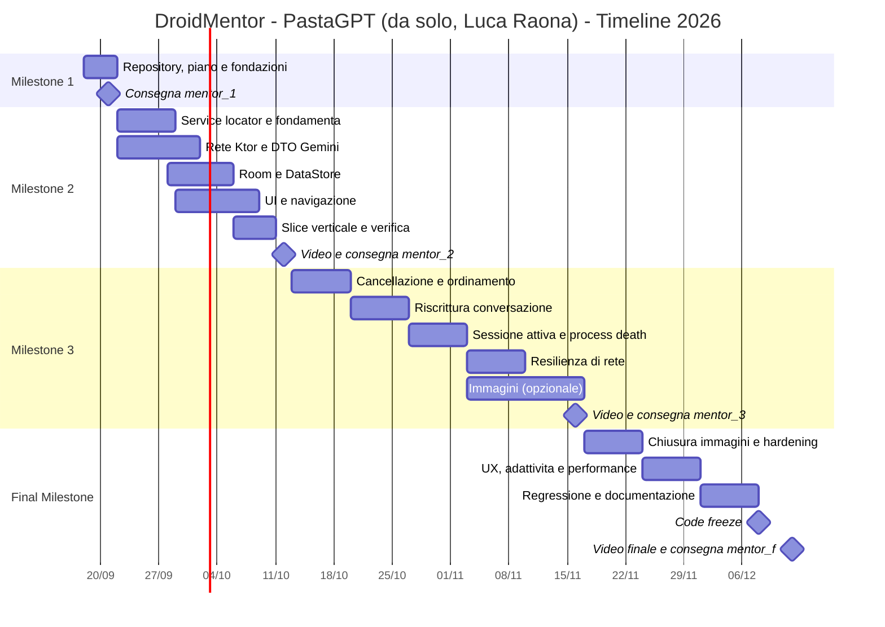

# DroidMentor — Piano di Progetto e Timeline

**Autore:** Luca Raona (matricola 55603) — progetto individuale, nome PastaGPT mantenuto
**Corso:** Mobile Devices Programming (PDM) — Instituto Superior de Engenharia de Lisboa
**Anno accademico:** 2026/2027 — Semestre invernale
**Docenti:** Prof. Paulo Pereira, Prof. Diogo Cardoso
**Scadenza finale:** 12 dicembre 2026
**Documento:** Deliverable della Milestone 1 (tag `mentor_1`)

| Versione | Data | Autore | Stato | Note |
|---|---|---|---|---|
| 1.0 | 18/09/2026 | Luca Raona | Approvato per M1 | Versione iniziale consegnata con `mentor_1` |
| 1.1 | *(da compilare)* | | Bozza | Revisione post-M2 |
| 1.2 | *(da compilare)* | | Bozza | Revisione post-M3 |

> **Nota di manutenzione.** Questo documento è vivo: al termine di ogni milestone va aggiornato lo stato dei task (`☐` → `☑`), le stime effettive e l'eventuale rischedulazione dei task non conclusi. La storia delle revisioni è tracciata nella tabella soprastante e nel log di Git.

---

## Indice

1. [Sintesi esecutiva](#1-sintesi-esecutiva)
2. [Autore e metodo di lavoro](#2-autore-e-metodo-di-lavoro)
3. [Vincoli tecnici non negoziabili](#3-vincoli-tecnici-non-negoziabili)
4. [Architettura di riferimento](#4-architettura-di-riferimento)
5. [Convenzioni operative e processo](#5-convenzioni-operative-e-processo)
6. [Legenda di stime, priorità e stato](#6-legenda-di-stime-priorità-e-stato)
7. [Timeline complessiva](#7-timeline-complessiva)
8. [Milestone 1 — Pianificazione e fondazioni (21/09/2026)](#8-milestone-1--pianificazione-e-fondazioni-21092026)
9. [Milestone 2 — Nucleo funzionante end-to-end (12/10/2026)](#9-milestone-2--nucleo-funzionante-end-to-end-12102026)
10. [Milestone 3 — Funzionalità avanzate e robustezza (16/11/2026)](#10-milestone-3--funzionalità-avanzate-e-robustezza-16112026)
11. [Final Milestone — Consolidamento e consegna (12/12/2026)](#11-final-milestone--consolidamento-e-consegna-12122026)
12. [Strategia di verifica](#12-strategia-di-verifica)
13. [Registro dei rischi](#13-registro-dei-rischi)
14. [Matrice di tracciabilità requisiti → task](#14-matrice-di-tracciabilità-requisiti--task)
15. [Appendici](#15-appendici)

---

## 1. Sintesi esecutiva

DroidMentor è un client Android **BYOK** (*Bring Your Own Key*) per Large Language Model, che espone all'utente un mentore conversazionale specializzato in sviluppo Android. La comunicazione avviene tramite l'API REST di Gemini, endpoint `generateContent`, **in modalità rigorosamente stateless**: non è ammesso alcun identificativo di sessione lato server, per cui è l'applicazione a ricostruire e trasmettere l'intera cronologia conversazionale a ogni singola interazione di rete.

L'applicazione è progettata come esperienza **offline-first**: la base dati locale (Room) è l'unica sorgente di verità per la UI, tutte le conversazioni restano consultabili in assenza di rete e la disponibilità della connessione viene verificata *prima* di ogni chiamata all'API, comunicando esplicitamente all'utente l'impossibilità di nuove interazioni quando si è offline.

Il piano si articola su **quattro milestone** e adotta un ciclo di vita incrementale a sprint settimanali. La strategia di fondo è la **verticalizzazione anticipata**: entro la Milestone 2 deve esistere una *slice* verticale completa (UI → ViewModel → Repository → Room + Ktor → Gemini → Room → UI) anche se minimale, in modo che i rischi integrativi più alti — serializzazione del payload stateless, service locator manuale, coerenza fra rete e persistenza — siano affrontati quando c'è ancora margine di manovra. Le funzionalità ad alta complessità logica (riscrittura della conversazione, ripristino della sessione attiva, allegati immagine) sono concentrate nella Milestone 3, mentre la Final Milestone è dedicata a integrazione, irrobustimento, regressione e consegna, con un **code freeze pianificato al 08/12/2026** che lascia quattro giorni di margine sulla scadenza.

**Obiettivi di qualità dichiarati**

| Obiettivo | Metrica verificabile |
|---|---|
| Stabilità | Zero crash (ANR/eccezioni non gestite) durante la regressione finale e la registrazione del video |
| Offline-first | Tutte le conversazioni leggibili con modalità aereo attiva; nessuna schermata vuota o in errore |
| Robustezza di rete | Gestione esplicita e testata di 400, 401/403, 429, 5xx, timeout, risposta malformata |
| Aderenza ai vincoli | Assenza totale di Hilt/Dagger, Retrofit, Gson/Moshi, Base64 persistito in Room |
| Copertura di test | ≥ 80 % sulla logica di costruzione del payload e sulla mappatura degli errori |
| Consegna | 4 tag Git (`mentor_1`, `mentor_2`, `mentor_3`, `mentor_f`) creati entro le rispettive scadenze |

---

## 2. Autore e metodo di lavoro

DroidMentor è un progetto individuale: lo realizzo io, **Luca Raona** (matricola 55603), sotto il nome di progetto **PastaGPT**.

**Organizzazione del lavoro.** Le tabelle WBS più sotto raggruppano i task per area tecnica (Rete, Persistenza, UI, Connettività, Verifica, Consegna) — è un raggruppamento tematico per orientarsi nel lavoro, non un'assegnazione a persone diverse. Un task che tocca più aree insieme va affrontato nella stessa sessione, senza interruzioni nel mezzo, così il ragionamento resta coerente dall'inizio alla fine.

**Metodo di verifica.** Sui task a rischio più alto (marcati 🔴 in §6) scrivo i test prima dell'implementazione, non dopo: è il modo più affidabile per non scoprire un errore concettuale a metà lavoro. Su ogni pull request, rileggo il diff per intero il giorno successivo a quando l'ho scritto, non subito dopo — a distanza di qualche ora si notano errori che a caldo restano invisibili.

**Gestione del rischio.** Il margine del code freeze (§7, §13) non è tempo extra per nuove funzionalità: è la riserva per un imprevisto — un'influenza, un altro esame che si sovrappone — perché non c'è nessun altro che possa assorbire un ritardo al posto mio.

**Ritmo di lavoro**

| Rito | Cadenza | Durata | Contenuto |
|---|---|---|---|
| Pianificazione sprint | Lunedì | 15 min | Scelgo i task dello sprint dalla WBS, confermo che la stima regga ancora |
| Diario di avanzamento | Merc./Ven. | 5 min | Una riga scritta: fatto / in corso / bloccato — utile come materiale grezzo per la scaletta del video di milestone |
| Autoreview + retrospettiva | Domenica | 30 min | Rileggo a mente fredda i diff della settimana, li verifico contro la Definition of Done, aggiusto il piano della settimana successiva |
| Revisione di milestone | Fine milestone | 60 min | Eseguo la checklist di accettazione dall'inizio alla fine, registro il video, creo il tag |

---

## 3. Vincoli tecnici non negoziabili

Questi vincoli derivano direttamente dall'enunciato dell'assignment e hanno valore di **criterio di accettazione trasversale**: la loro violazione invalida la consegna indipendentemente dalla qualità funzionale del risultato. Ogni pull request deve essere verificata rispetto a questa tabella.

| # | Vincolo | Implicazione implementativa | Anti-pattern da evitare | Task che lo indirizzano |
|---|---|---|---|---|
| V1 | **Dependency injection manuale** tramite la classe `Application` usata come *service locator*. Hilt/Dagger **vietati**. | `DroidMentorApplication` espone i singleton (database, DataStore, `HttpClient`, repository) con inizializzazione *lazy*. I ViewModel vengono creati con `ViewModelProvider.Factory` scritte a mano (`viewModelFactory { initializer { … } }`). | Qualsiasi annotazione `@HiltAndroidApp`, `@Inject`, `@Module`, `@Provides`; plugin KSP di Hilt nel `build.gradle.kts`. | M2-01, M2-02 |
| V2 | **Rete esclusivamente con Ktor Client + Kotlinx Serialization.** | Plugin `ContentNegotiation` con `Json { ignoreUnknownKeys = true }`; DTO annotati `@Serializable`; engine OkHttp o CIO. | Retrofit, Volley, `HttpURLConnection`, Gson, Moshi, Jackson. | M2-05, M2-06, M2-07 |
| V3 | **Persistenza delle chat con Room.** | Entità `chats` e `messages` con chiave esterna e `onDelete = CASCADE`; DAO che espongono `Flow`; schema esportato e versionato. | Salvataggio della cronologia in `SharedPreferences`, in file JSON o solo in memoria. | M2-11, M2-12, M2-13 |
| V4 | **Chiave API BYOK salvata con DataStore.** | `Preferences DataStore` dedicato, separato da eventuali preferenze di UI; esposizione come `Flow<String?>`; possibilità di cancellazione. | Chiave in `SharedPreferences`, in Room, in una costante nel codice, in `local.properties` committato, nel `BuildConfig`. | M2-14, MF-06 |
| V5 | **Modalità stateless obbligatoria.** Vietato l'uso di ID di sessione multi-turn lato server. | Ogni richiesta trasporta l'intero array `contents` con alternanza rigorosa dei ruoli `user` / `model`. Lo stato conversazionale vive **solo** in Room. | Uso di API o endpoint con stato server-side (es. sessioni persistenti o *interaction id*); memorizzazione di un `conversationId` restituito dal servizio. | M2-08, M2-15 |
| V6 | **Persona impostata via `system_instruction`.** | Campo `system_instruction` presente in ogni richiesta, con testo centralizzato in un'unica costante. Non sono richieste tecniche RAG o di prompt engineering avanzato. | Iniezione della persona come primo messaggio `user` dell'array `contents`. | M2-10 |
| V7 | **Esperienza offline-first.** | Room è l'unica sorgente di verità per la UI; verifica della connettività *prima* della chiamata; messaggio esplicito quando si è offline. | Schermate che dipendono dalla risposta di rete per popolarsi; `try/catch` silenzioso che lascia la UI vuota. | M2-15, M2-23, M2-24 |
| V8 | **Gestione graziosa degli errori HTTP** (es. 429, 500). | Mappatura tipizzata `sealed interface` degli esiti; nessuna eccezione propagata alla UI; feedback comprensibile all'utente. | Crash su `ClientRequestException`; messaggi tecnici grezzi mostrati all'utente. | M2-09, M3-08, M3-09 |
| V9 | **Immagini (requisito opzionale valorizzato):** in Room si persiste **solo l'URI/percorso del file**. | File salvati in storage locale dell'app; codifica `inline_data` in Base64 costruita **in memoria** al solo momento della richiesta e mai scritta su DB. | Colonna `TEXT` contenente la stringa Base64; `BLOB` con i byte dell'immagine. | M3-11 … M3-15 |
| V10 | **Consegne tramite tag Git** `mentor_X` sul repository, con accesso completo ai docenti e `README.md` in radice con la tua identificazione. | Tag annotati e pushati; README aggiornato a ogni milestone con il link al video. | Tag leggeri creati localmente e mai pushati; README mancante o incompleto. | M1-01, M1-02, M1-09, M2-31, M3-18, MF-11 |

---

## 4. Architettura di riferimento

### 4.1 Stratificazione

Architettura a tre strati con flusso di dati unidirezionale (UDF), senza framework di DI.

```
┌──────────────────────────────────────────────────────────────────┐
│  UI  (Jetpack Compose + Navigation)                              │
│  TitleScreen · ChatHistoryScreen · ActiveChatScreen              │
│  AboutScreen · SettingsScreen                                    │
│        ▲ UiState (StateFlow)          │ eventi utente            │
├────────┴───────────────────────────────▼─────────────────────────┤
│  PRESENTATION  ViewModel + UiState immutabili                    │
│  creati da ViewModelProvider.Factory manuali                     │
├──────────────────────────────────────────────────────────────────┤
│  DOMAIN  Chat · Message · Role · HistoryPayloadBuilder           │
│          (Kotlin puro, nessuna dipendenza da Android)            │
├──────────────────────────────────────────────────────────────────┤
│  DATA                                                            │
│   ChatRepository ──► Room (SINGLE SOURCE OF TRUTH)               │
│        │                                                         │
│        └──────────► GeminiRemoteDataSource (Ktor)                │
│   SettingsRepository ──► DataStore (chiave BYOK)                 │
│   ConnectivityObserver ──► ConnectivityManager                   │
├──────────────────────────────────────────────────────────────────┤
│  DroidMentorApplication  ← SERVICE LOCATOR (singleton lazy)      │
└──────────────────────────────────────────────────────────────────┘
```

### 4.2 Principio cardine: Room come sorgente di verità

La UI **non osserva mai** direttamente il risultato di una chiamata di rete. Il ciclo è:

1. L'utente invia un messaggio → il repository lo inserisce subito in Room con stato `SENDING`.
2. Il `Flow` del DAO notifica la UI, che mostra immediatamente il messaggio (*optimistic update*).
3. Il repository verifica la connettività, costruisce il payload con **tutta** la cronologia e chiama Gemini.
4. L'esito viene scritto in Room: risposta del modello come nuova riga con ruolo `MODEL`, oppure aggiornamento del messaggio a stato `FAILED`.
5. La UI si aggiorna di nuovo osservando solo Room.

Questa scelta soddisfa contemporaneamente V3, V5 e V7 e rende banale il requisito di consultazione offline.

### 4.3 Stack tecnologico

| Ambito | Scelta | Motivazione |
|---|---|---|
| Linguaggio | Kotlin + Coroutines/Flow | Standard del corso; concorrenza strutturata |
| UI | Jetpack Compose + Material 3 | Dichiarativo, allineato alle pratiche moderne |
| Navigazione | Navigation Compose con rotte tipizzate | Grafo esplicito, deep link verso Settings |
| Rete | **Ktor Client** (engine OkHttp) | Vincolo V2 |
| Serializzazione | **Kotlinx Serialization** | Vincolo V2 |
| Persistenza | **Room** | Vincolo V3 |
| Preferenze/segreti | **DataStore (Preferences)** | Vincolo V4 |
| Immagini | Coil (solo rendering) | Caricamento asincrono da URI locale |
| Test | JUnit 4, `kotlinx-coroutines-test`, Ktor `MockEngine`, Room in-memory, Compose UI Test | Copertura dei tre livelli della piramide |
| CI | GitHub Actions | Build e test automatici su ogni PR |

### 4.4 Configurazione di progetto

| Parametro | Valore | Nota |
|---|---|---|
| `minSdk` | 26 | Consente `java.time` e API di storage moderne |
| `targetSdk` / `compileSdk` | Ultima stabile disponibile | Da fissare in `libs.versions.toml` |
| Moduli | Singolo modulo `:app` con package per layer | Modularizzazione non richiesta; evita complessità non necessaria |
| Permessi | `INTERNET`, `ACCESS_NETWORK_STATE`, `CAMERA` (solo se si implementa il requisito opzionale) | Nessun permesso di storage grazie al Photo Picker |

---

## 5. Convenzioni operative e processo

### 5.1 Repository e branching

- **Repository:** `pastagpt-droidmentor` (privato), con accesso completo concesso ai Prof. Paulo Pereira e Prof. Diogo Cardoso.
- **Modello:** *trunk-based* con branch a vita breve. `main` è sempre compilabile e verde in CI.
- **Nomenclatura branch:** `feat/<id-task>-<slug>`, `fix/<slug>`, `docs/<slug>`, `chore/<slug>`.
  Esempio: `feat/m2-08-history-payload-builder`.
- **Commit:** Conventional Commits (`feat:`, `fix:`, `refactor:`, `test:`, `docs:`, `chore:`), messaggio in inglese, riferimento al task nel corpo.
- **Pull request:** usata come checkpoint di autoreview anche da solo — apri una PR dal branch della feature, lascia che il template con la checklist dei vincoli giri su di essa, e fai merge solo dopo aver riletto il diff una volta per intero, idealmente il giorno dopo. PR di dimensione massima consigliata: ~400 righe modificate.
- **Tag:** annotati e pushati esplicitamente.
  ```bash
  git tag -a mentor_1 -m "Milestone 1 - Project plan"
  git push origin mentor_1
  ```

### 5.2 Definition of Done (per singolo task)

Un task è *Done* solo se tutte le condizioni seguenti sono soddisfatte:

- ☐ Il codice compila senza warning nuovi e supera `./gradlew lint`.
- ☐ Sono presenti i test previsti dalla strategia di verifica per quel livello.
- ☐ La suite completa (`./gradlew test connectedAndroidTest`) è verde in locale e in CI.
- ☐ Il diff è stato riletto per intero, dopo una pausa, prima del merge (vedi §2 sull'autoreview).
- ☐ Nessun vincolo della sezione 3 è stato violato (verifica esplicita in fase di review).
- ☐ Nessun segreto, chiave o token è finito nel repository o nei log.
- ☐ La documentazione impattata (README, ADR, questo piano) è aggiornata nello stesso commit.

### 5.3 Definition of Done (per milestone)

- ☐ Tutti i task pianificati sono *Done* o formalmente rischedulati con motivazione scritta.
- ☐ L'applicazione si installa ed è utilizzabile su un dispositivo fisico e su emulatore.
- ☐ Il video (ove previsto) rispetta la durata di **5–7 minuti** e copre tutti i punti richiesti.
- ☐ Il `README.md` di radice contiene la tua identificazione e il link al video.
- ☐ Il tag `mentor_X` è creato **e pushato** entro la data di scadenza.
- ☐ La checklist di accettazione della milestone è compilata in questo documento.

---

## 6. Legenda di stime, priorità e stato

**Difficoltà**

| Simbolo | Livello | Significato operativo |
|---|---|---|
| 🟢 | Bassa | Attività lineare, API note, rischio tecnico trascurabile. Eseguibile in autonomia. |
| 🟡 | Media | Richiede progettazione o integrazione fra più componenti. Review attenta consigliata. |
| 🔴 | Alta | Logica critica, alto rischio di regressione o di errore concettuale. **Test scritti prima dell'implementazione obbligatori** (il sostituto solitario del pair programming — vedi §2). |

**Priorità**

| Sigla | Significato |
|---|---|
| **M** | *Must* — requisito esplicito dell'enunciato: la sua assenza compromette la valutazione |
| **S** | *Should* — qualità attesa, fortemente raccomandato |
| **C** | *Could* — requisito opzionale valorizzato o miglioria |

**Stima:** espressa in **ore-uomo ideali** (lavoro effettivo, escluse interruzioni). Fattore di conversione prudenziale consigliato: **1 ora ideale ≈ 1,4 ore di calendario**.

**Stato:** `☐` da fare · `◐` in corso · `☑` completato · `⊘` rischedulato.

---

## 7. Timeline complessiva

| Fase | Periodo | Sprint | Focus | Ore ideali stimate |
|---|---|---|---|---|
| **Milestone 1** | 18/09 → **21/09/2026** | Sprint 0 | Pianificazione, repository, fondazioni di progetto | ~11 h |
| **Milestone 2** | 22/09 → **12/10/2026** | Sprint 1–3 | Architettura, rete stateless, persistenza, slice verticale completa, strategia di verifica | ~92 h |
| **Milestone 3** | 13/10 → **16/11/2026** | Sprint 4–8 | Cancellazione, riscrittura conversazione, sessione attiva, resilienza, immagini | ~83 h |
| **Final Milestone** | 17/11 → **12/12/2026** | Sprint 9–12 | Integrazione, hardening, UX, regressione, consegna | ~62 h |
| | | | **Totale** | **~248 h, tutte da solo** (~21 h ideali/settimana su 12 settimane ≈ 29 h di calendario/settimana con il fattore 1,4×) |

> **Verifica di sostenibilità.** 248 ore ideali da solo sulle ~12 settimane fino al 12/12/2026 sono circa 21 ore ideali a settimana — circa 29 ore di calendario a settimana applicando il fattore 1,4× del §6. È un carico consistente sopra a qualunque altro corso tu abbia in questo semestre, e non è distribuito uniformemente: la Milestone 2 da sola è più pesante di questa media (vedi il suo totale più sotto). Se il ritmo non regge contro il tuo orario reale, il punto da tagliare sono i task *Could* (il requisito opzionale delle immagini, M3-11…M3-15, MF-01) e i *Should*, non i *Must* — vedi §13, rischio R4.

### 7.1 Obiettivi di sprint

| Sprint | Settimana | Obiettivo verificabile a fine sprint |
|---|---|---|
| **0** | 18–21/09 | Repository operativo, piano approvato, tag `mentor_1` pushato |
| **1** | 22–28/09 | Progetto Android che compila con tutte le dipendenze; service locator funzionante; DTO Gemini serializzano/deserializzano correttamente in test |
| **2** | 29/09–05/10 | Room + DataStore operativi; navigazione fra le 5 schermate; Settings salva e rilegge la chiave |
| **3** | 06–12/10 | **Slice verticale completa:** invio messaggio → risposta del modello → persistenza → rilettura offline. Video M2 registrato, tag `mentor_2` |
| **4** | 13–19/10 | Cancellazione conversazioni con CASCADE; ordinamento deterministico dei messaggi |
| **5** | 20–26/10 | Riscrittura della conversazione funzionante end-to-end (troncamento + reinvio) |
| **6** | 27/10–02/11 | Ripristino della sessione attiva al lancio; sopravvivenza a process death |
| **7** | 03–09/11 | Resilienza di rete: retry con backoff, stati per messaggio, azione "Riprova" |
| **8** | 10–16/11 | Requisito opzionale immagini in stato dimostrabile. Video M3, tag `mentor_3` |
| **9** | 17–23/11 | Chiusura del requisito immagini, ciclo di vita dei file, hardening errori |
| **10** | 24–30/11 | Revisione UX, adattività, accessibilità, performance |
| **11** | 01–07/12 | Regressione completa su matrice dispositivi; documentazione finale |
| **12** | 08–12/12 | **Code freeze 08/12.** Solo bugfix critici. Video finale, build release, tag `mentor_f` |

### 7.2 Diagramma di Gantt



---

## 8. Milestone 1 — Pianificazione e fondazioni (21/09/2026)

> **Settimana 3 del semestre. Finestra effettiva: 4 giorni.**

### 8.1 Obiettivo

Consegnare il piano di progetto richiesto dall'enunciato e predisporre l'infrastruttura di lavoro. I task marcati *(anticipo su M2)* non sono richiesti dai criteri di accettazione della Milestone 1, ma vanno eseguiti ora perché rimuovono attrito all'avvio dello Sprint 1: creare lo scheletro del progetto Gradle il giorno prima della prima *feature* è la causa più comune di slittamento nelle prime settimane.

### 8.2 WBS — Work Breakdown Structure

| ID | Task | Descrizione operativa | Pri. | Diff. | Stima | Dip. | Stato |
|---|---|---|---|---|---|---|---|
| M1-01 | Creazione repository | Repo GitHub `pastagpt-droidmentor`, privato. Invito ai Prof. Paulo Pereira e Diogo Cardoso con **accesso completo**. `.gitignore` per Android/Kotlin/IDEA. | M | 🟢 | 0,5 h | — | ☑ |
| M1-02 | `README.md` di radice | La tua identificazione: nome completo, numero studente, indirizzo istituzionale, handle GitHub. Titolo del progetto e riferimento al corso. Segnaposto per i link ai video delle milestone. | M | 🟢 | 0,5 h | M1-01 | ☑ |
| M1-03 | Piano di progetto | Redazione e revisione di questo documento (`PROJECT_PLAN.md`), con timeline, task e criteri di accettazione. L'enunciato chiede anche "a chi sono assegnati" i task: essendo un progetto individuale, l'assegnazione è implicita — sono tutti miei. Link in evidenza dal README. | M | 🟡 | 3 h | M1-01 | ☑ |
| M1-04 | Convenzioni di lavoro | `CONTRIBUTING.md` con branching, commit convention, policy di review. `.github/pull_request_template.md` con la checklist dei vincoli della sezione 3. `CODEOWNERS`. | S | 🟢 | 1 h | M1-01 | ☑ |
| M1-05 | Board di progetto | GitHub Projects con colonne *Backlog / Sprint / In review / Done*. Import dei task di questo piano come issue, con label per milestone e difficoltà. | S | 🟢 | 1 h | M1-03 | ☐ |
| M1-06 | Scaffolding progetto *(anticipo su M2)* | Progetto Android Studio: Kotlin, Compose, `minSdk 26`, package `pt.isel.pdm.droidmentor`. Verifica che l'app vuota si avvii su emulatore. | S | 🟡 | 2 h | M1-01 | ☑ |
| M1-07 | Version catalog *(anticipo su M2)* | `gradle/libs.versions.toml` con Compose BOM, Navigation, Ktor (core, engine, content-negotiation, logging), kotlinx-serialization, Room (runtime, ktx, compiler KSP), DataStore Preferences, Coil, librerie di test. Sincronizzazione riuscita. | S | 🟡 | 1,5 h | M1-06 | ☑ |
| M1-08 | Provisioning chiave Gemini | Una chiave API da Google AI Studio (idealmente una seconda di riserva da un account diverso). Verifica dei limiti del piano gratuito e annotazione delle quote (rilevante per i test del percorso HTTP 429). **Nessuna chiave committata.** | M | 🟢 | 0,5 h | — | ☑ |
| M1-09 | Tag `mentor_1` | Commit finale, tag annotato, push del tag. Verifica su GitHub che il tag sia visibile e che i docenti abbiano accesso. | M | 🟢 | 0,25 h | M1-02, M1-03 | ☐ |

**Totale stimato:** ~10,25 ore ideali.

### 8.3 Checklist di accettazione (Milestone 1)

Derivata letteralmente dagli *Acceptance criteria* dell'enunciato:

- ☐ Il repository è correttamente taggato **`mentor_1`** ed il tag è stato pushato sul remoto.
- ☑ Il repository contiene la **timeline del piano di progetto** con l'indicazione dei task pianificati (l'assegnazione richiesta dall'enunciato è implicita: progetto individuale, sono tutti miei).
- ☑ Il file **`README.md` in radice** contiene la tua identificazione.
- ☐ Entrambi i docenti dispongono di **accesso completo** al repository (verifica in *Settings → Collaborators*).
- ☑ I segnaposto `[email]` ed `[@handle]` nel template del README (Appendice C) sono stati sostituiti con i tuoi dati reali.

### 8.4 Rischi specifici della milestone

| Rischio | Mitigazione |
|---|---|
| Finestra di soli 4 giorni | Priorità assoluta a M1-01, M1-02, M1-03, M1-09: sono gli unici task valutati. Lo scaffolding può slittare allo Sprint 1 senza conseguenze sulla valutazione. |
| Invito ai docenti non accettato per tempo | Inviare gli inviti il **primo giorno** e verificare lo stato prima del tag; documentare la data di invio nel README. |

---

## 9. Milestone 2 — Nucleo funzionante end-to-end (12/10/2026)

> **Settimana 6 del semestre. 3 settimane, Sprint 1–3.**

### 9.1 Obiettivo

Costruire l'intera impalcatura architetturale e raggiungere una **slice verticale dimostrabile**: l'utente configura la propria chiave, apre una nuova conversazione, invia un messaggio, riceve la risposta del mentore, chiude l'app, attiva la modalità aereo e rilegge la conversazione. Tutti i vincoli tecnici della sezione 3 devono essere in vigore già a questo stadio, perché correggere a posteriori una scelta di dependency injection o di serializzazione ha un costo sproporzionato.

Attenzione particolare al fatto che la Milestone 2 richiede esplicitamente, nel video, la **descrizione della strategia di verifica adottata**: i task del workstream F non sono opzionali né rinviabili.

### 9.2 WBS — Workstream A: Fondazioni e dependency injection manuale

| ID | Task | Descrizione operativa | Pri. | Diff. | Stima | Dip. | Stato |
|---|---|---|---|---|---|---|---|
| M2-01 | Service locator | `DroidMentorApplication : Application` che espone, con `by lazy`, il database Room, il DataStore, l'`HttpClient` Ktor e i repository. Extension `val Context.app: DroidMentorApplication`. **Nessuna traccia di Hilt/Dagger (V1).** | M | 🟡 | 4 h | M1-07 | ☐ |
| M2-02 | Factory dei ViewModel | Interfaccia `DependencyContainer` implementata dalla `Application`, così da poterla sostituire con un fake nei test. `ViewModelProvider.Factory` costruite con `viewModelFactory { initializer { … } }`. | M | 🟡 | 3 h | M2-01 | ☐ |
| M2-03 | Struttura a package e design system | Package `data/{local,remote,repository}`, `domain`, `ui/{screens,components,theme,navigation}`. Tema Material 3, palette, tipografia, spaziature, supporto tema chiaro/scuro. | S | 🟢 | 2 h | M1-06 | ☐ |
| M2-04 | Modello di dominio | `Chat(id, title, createdAt, updatedAt)`, `Message(id, chatId, role, text, imagePath?, seq, status, createdAt)`, `enum Role { USER, MODEL }`, `enum MessageStatus { SENDING, SENT, FAILED }`. Kotlin puro, senza dipendenze da Android. | M | 🟢 | 2 h | — | ☐ |

### 9.3 WBS — Workstream B: Rete (Ktor + Kotlinx Serialization)

| ID | Task | Descrizione operativa | Pri. | Diff. | Stima | Dip. | Stato |
|---|---|---|---|---|---|---|---|
| M2-05 | Configurazione `HttpClient` | Engine OkHttp; `ContentNegotiation` con `Json { ignoreUnknownKeys = true; explicitNulls = false }`; `HttpTimeout` (connect 10 s, socket 60 s); `DefaultRequest` con base URL `https://generativelanguage.googleapis.com/`; plugin `Logging` **attivo solo in debug** e configurato per non stampare header né corpo contenenti la chiave. | M | 🟡 | 3 h | M2-01 | ☐ |
| M2-06 | DTO Gemini | `@Serializable` per `GenerateContentRequest(systemInstruction, contents, generationConfig)`, `Content(role, parts)`, `Part(text, inlineData?)`, `GenerateContentResponse(candidates, usageMetadata)`, `Candidate(content, finishReason)`, `ApiErrorEnvelope(error)`. Uso di `@SerialName` per i campi in snake_case (es. `system_instruction`, `inline_data`, `mime_type`). | M | 🟡 | 4 h | M2-05 | ☐ |
| M2-07 | `GeminiRemoteDataSource` | `suspend fun generateContent(history, systemInstruction, apiKey): ApiResult<String>`. `POST /v1beta/models/{model}:generateContent` con header `x-goog-api-key`. Modello configurabile da costante unica. **Nessun identificativo di sessione (V5).** | M | 🔴 | 5 h | M2-06 | ☐ |
| M2-08 | `HistoryPayloadBuilder` | Componente di dominio puro che trasforma `List<Message>` in `List<Content>` garantendo: alternanza rigorosa `user`/`model`, esclusione dei messaggi in stato `FAILED`, troncamento configurabile dei turni più vecchi per contenere il costo in token, preservazione dell'ordine tramite `seq`. **Cuore del requisito stateless: da testare in modo esaustivo.** | M | 🔴 | 5 h | M2-04 | ☐ |
| M2-09 | Mappatura degli errori | `sealed interface ApiResult<out T>` con `Success`, `InvalidApiKey` (401/403), `BadRequest` (400), `RateLimited(retryAfterSeconds)` (429), `ServerError` (5xx), `NetworkUnavailable` (`IOException`), `MalformedResponse` (`SerializationException`), `Unknown`. Nessuna eccezione oltrepassa il data source (V8). | M | 🟡 | 4 h | M2-07 | ☐ |
| M2-10 | `system_instruction` della persona | Testo unico che definisce il mentore Android senior: tono, ambito di competenza, preferenza per le best practice ufficiali, richiesta di esempi in Kotlin. Centralizzato in `MentorPersona.kt` (V6). | M | 🟢 | 1 h | M2-06 | ☐ |

### 9.4 WBS — Workstream C: Persistenza (Room + DataStore)

| ID | Task | Descrizione operativa | Pri. | Diff. | Stima | Dip. | Stato |
|---|---|---|---|---|---|---|---|
| M2-11 | Entità Room | `ChatEntity(id, title, createdAt, updatedAt)` e `MessageEntity(id, chatId, role, text, imagePath, seq, status, createdAt)` con `@ForeignKey(onDelete = CASCADE)` e `@Index("chatId")`. Converter per gli enum. | M | 🟡 | 4 h | M2-04 | ☐ |
| M2-12 | DAO | `ChatDao`: `observeChats(): Flow<List<ChatWithLastMessage>>`, `insert`, `updateTitle`, `deleteById`. `MessageDao`: `observeMessages(chatId): Flow<List<MessageEntity>>`, `insert`, `updateStatus`, `deleteFromSeq(chatId, seq)`, `nextSeq(chatId)`. Query di relazione con `@Transaction` + `@Relation`. | M | 🟡 | 4 h | M2-11 | ☐ |
| M2-13 | Database | `DroidMentorDatabase : RoomDatabase` versione 1, export dello schema in `app/schemas` **versionato su Git** (indispensabile per testare le migrazioni successive). | M | 🟢 | 2 h | M2-12 | ☐ |
| M2-14 | `SettingsRepository` | Preferences DataStore dedicato: `apiKey: Flow<String?>`, `saveApiKey`, `clearApiKey`. La chiave non viene mai loggata né inclusa in report di crash (V4). | M | 🟡 | 3 h | M2-01 | ☐ |
| M2-15 | `ChatRepository` offline-first | Orchestrazione del ciclo descritto in §4.2: inserimento ottimistico, verifica connettività, costruzione del payload, chiamata, scrittura dell'esito. La UI osserva **solo** Room (V7). | M | 🔴 | 5 h | M2-09, M2-12, M2-23 | ☐ |

### 9.5 WBS — Workstream D: Interfaccia utente e navigazione

| ID | Task | Descrizione operativa | Pri. | Diff. | Stima | Dip. | Stato |
|---|---|---|---|---|---|---|---|
| M2-16 | Grafo di navigazione | `NavHost` con rotte `Title`, `ChatHistory`, `ActiveChat/{chatId}`, `About`, `Settings`, conformi alla Figura 1 dell'enunciato (compresi i percorsi di ritorno). Gestione del back stack. | M | 🟡 | 4 h | M2-03 | ☐ |
| M2-17 | Title Screen | Menu principale: logo/titolo, voci *Conversazioni*, *Impostazioni*, *Informazioni*. Punto di ingresso dell'app quando non esiste una chat attiva. | M | 🟢 | 2 h | M2-16 | ☐ |
| M2-18 | About Screen | Nome dell'applicazione, versione, il tuo nome, corso e istituzione, crediti delle librerie di terze parti. | M | 🟢 | 1,5 h | M2-16 | ☐ |
| M2-19 | Settings Screen | Campo per la chiave API con `PasswordVisualTransformation` e toggle di visibilità, salvataggio, cancellazione, indicatore *chiave configurata / non configurata*, validazione di formato non vuoto, feedback tramite snackbar. | M | 🟡 | 4 h | M2-14, M2-16 | ☐ |
| M2-20 | Chat History Screen | `LazyColumn` alimentata dal `Flow` di Room: titolo, anteprima dell'ultimo messaggio, data relativa. Stato vuoto illustrato. FAB *Nuova conversazione*. | M | 🟡 | 4 h | M2-12, M2-16 | ☐ |
| M2-21 | Active Chat Screen | Lista dei messaggi con bubble differenziate per ruolo, barra di input con invio, auto-scroll all'ultimo messaggio, indicatore *il mentore sta scrivendo*, gestione dell'`imePadding`. | M | 🔴 | 6 h | M2-15, M2-16 | ☐ |
| M2-22 | ViewModel e UiState | Un ViewModel per schermata con `UiState` immutabile esposto come `StateFlow`; eventi one-shot (snackbar, navigazione) tramite `Channel`/`SharedFlow`. Nessuna logica di business nei Composable. | M | 🟡 | 4 h | M2-02, M2-15 | ☐ |

### 9.6 WBS — Workstream E: Connettività

| ID | Task | Descrizione operativa | Pri. | Diff. | Stima | Dip. | Stato |
|---|---|---|---|---|---|---|---|
| M2-23 | `ConnectivityObserver` | Wrapper su `ConnectivityManager.registerNetworkCallback` esposto come `Flow<ConnectivityStatus>`, con verifica di `NET_CAPABILITY_VALIDATED`. Registrato nel service locator. | M | 🟡 | 3 h | M2-01 | ☐ |
| M2-24 | Gating offline | Verifica della connettività **prima** di ogni chiamata (V7). Se offline: input di invio disabilitato, banner persistente e comprensibile in cima alla Active Chat, cronologia comunque interamente consultabile. | M | 🟡 | 3 h | M2-21, M2-23 | ☐ |

### 9.7 WBS — Workstream F: Verifica *(richiesta esplicitamente nel video M2)*

| ID | Task | Descrizione operativa | Pri. | Diff. | Stima | Dip. | Stato |
|---|---|---|---|---|---|---|---|
| M2-25 | Documento `VERIFICATION.md` | Formalizzazione della strategia descritta nella sezione 12: livelli, strumenti, criteri di uscita, matrice dispositivi. È la fonte da cui si costruisce la parte del video dedicata alla verifica. | M | 🟡 | 2 h | — | ☐ |
| M2-26 | Test di `HistoryPayloadBuilder` | Casi: conversazione vuota, singolo turno, N turni alternati, messaggi `FAILED` esclusi, troncamento oltre soglia, assenza di qualsiasi identificativo di sessione nel payload prodotto. | M | 🟡 | 3 h | M2-08 | ☐ |
| M2-27 | Test di rete con `MockEngine` | Simulazione di 200 con payload valido, 400, 401, 429 con header `Retry-After`, 500, JSON malformato, timeout. Verifica della mappatura su `ApiResult` e dell'assenza di eccezioni propagate. | M | 🟡 | 4 h | M2-09 | ☐ |
| M2-28 | Test strumentati dei DAO | Room in-memory: inserimenti, osservazione dei `Flow`, cancellazione a cascata, monotonia di `seq`. | M | 🟡 | 3 h | M2-12 | ☐ |
| M2-29 | Continuous Integration | Workflow GitHub Actions su `push` e `pull_request`: `assembleDebug`, `testDebugUnitTest`, `lint`. Badge di stato nel README. | S | 🟡 | 2 h | M1-07 | ☐ |

### 9.8 WBS — Workstream G: Consegna

| ID | Task | Descrizione operativa | Pri. | Diff. | Stima | Dip. | Stato |
|---|---|---|---|---|---|---|---|
| M2-30 | Video Milestone 2 | Registrazione **5–7 minuti** secondo la scaletta dell'Appendice D: dimostrazione delle funzionalità implementate, discussione delle decisioni più rilevanti (service locator manuale, stateless, offline-first), **descrizione della strategia di verifica**, stato attuale del progetto. Upload su piattaforma con link stabile e accesso verificato in incognito. | M | 🟡 | 4 h | tutti M2 | ☐ |
| M2-31 | Tag `mentor_2` | Inserimento del link al video nel `README.md`, commit, tag annotato, push. | M | 🟢 | 0,5 h | M2-30 | ☐ |

**Totale stimato Milestone 2:** ~92 ore ideali, tutte da solo — circa 31 ore ideali a settimana sulle 3 settimane (≈43 ore di calendario a settimana con il fattore 1,4×). È il blocco più pesante di tutto il piano; vedi la nota di sostenibilità al §7.

### 9.9 Checklist di accettazione (Milestone 2)

- ☐ Il repository è correttamente taggato **`mentor_2`** e il tag è stato pushato.
- ☐ Il `README.md` contiene il **link al video**, verificato come accessibile da un account esterno.
- ☐ Il video dura **tra 5 e 7 minuti**.
- ☐ Il video **dimostra le funzionalità implementate**.
- ☐ Il video **discute le decisioni più rilevanti**.
- ☐ Il video **descrive la strategia di verifica adottata**.
- ☐ Il video **illustra lo stato attuale del progetto**.

**Verifica interna aggiuntiva (non richiesta dall'enunciato, ma necessaria per non accumulare debito):**

- ☐ Ricerca in tutto il codice di `hilt`, `dagger`, `retrofit`, `gson`, `moshi`: **zero occorrenze**.
- ☐ Ispezione del payload effettivamente inviato: contiene `system_instruction` e l'intero array `contents` con ruoli alternati.
- ☐ Prova manuale con modalità aereo: le conversazioni restano leggibili e il messaggio di indisponibilità è chiaro.

---

## 10. Milestone 3 — Funzionalità avanzate e robustezza (16/11/2026)

> **Settimana 11 del semestre. 5 settimane, Sprint 4–8.**

### 10.1 Obiettivo

Implementare i requisiti a più alta complessità logica — cancellazione delle conversazioni, **riscrittura della conversazione**, ripristino della sessione attiva al lancio — e portare il requisito opzionale delle immagini a uno stato dimostrabile. Questa è la milestone con il maggior rischio di regressione: ogni task marcato 🔴 modifica invarianti già coperte da test esistenti.

### 10.2 WBS — Gestione delle conversazioni

| ID | Task | Descrizione operativa | Pri. | Diff. | Stima | Dip. | Stato |
|---|---|---|---|---|---|---|---|
| M3-01 | Cancellazione conversazioni | Gesto di swipe e/o menu contestuale nella Chat History, dialog di conferma, cancellazione con `CASCADE` sui messaggi, snackbar con azione *Annulla* (finestra di 5 s prima della cancellazione effettiva dei file associati). | M | 🟡 | 4 h | M2-12, M2-20 | ☐ |
| M3-02 | Titolazione delle conversazioni | Titolo generato automaticamente dai primi caratteri del primo messaggio utente, con possibilità di rinomina manuale. | S | 🟢 | 2 h | M3-01 | ☐ |
| M3-03 | **Riscrittura della conversazione** | L'utente modifica un proprio messaggio in **qualsiasi posizione**. Transazione Room atomica: aggiornamento del testo, `deleteFromSeq(chatId, seq + 1)` che invalida ed elimina tutti gli scambi successivi, ricostruzione del payload sulla cronologia troncata e reinvio all'API. In caso di fallimento di rete, lo stato precedente al reinvio deve restare coerente. | M | 🔴 | 8 h | M2-15, M3-05 | ☐ |
| M3-04 | UI di riscrittura | Long-press su una bubble utente → menu contestuale (*Modifica*, *Copia*, *Elimina*). In modifica: dialog o barra di input precompilata con avviso esplicito che i messaggi successivi verranno eliminati; conferma richiesta. | M | 🔴 | 5 h | M3-03 | ☐ |
| M3-05 | Ordinamento deterministico | Introduzione del campo `seq` monotono per chat, popolato in transazione. **Non affidarsi ai timestamp**: due messaggi inseriti nello stesso millisecondo renderebbero non deterministico l'ordine e corromperebbero l'alternanza dei ruoli nel payload. Migrazione Room 1 → 2 con test. | M | 🟡 | 3 h | M2-13 | ☐ |

### 10.3 WBS — Gestione dello stato e ciclo di vita

| ID | Task | Descrizione operativa | Pri. | Diff. | Stima | Dip. | Stato |
|---|---|---|---|---|---|---|---|
| M3-06 | Ripristino della sessione attiva | `activeChatId` salvato in DataStore all'ingresso nella Active Chat e **cancellato solo** su uscita esplicita (back, chiusura della conversazione). Al lancio, routing condizionale: se presente → Active Chat, altrimenti → Title. Implementa la semantica dell'enunciato ("*un utente è considerato precedentemente impegnato se non ha esplicitamente chiuso o abbandonato la conversazione attiva prima della terminazione dell'applicazione*"). | M | 🔴 | 5 h | M2-14, M2-16 | ☐ |
| M3-07 | Sopravvivenza a process death | `SavedStateHandle` per la bozza di testo non inviata e per la posizione di scroll. Verifica con l'opzione *Non mantenere le attività* e con `adb shell am kill`. | S | 🟡 | 4 h | M2-22 | ☐ |
| M3-08 | Politica di ritentativi | Backoff esponenziale con jitter per 429 e 503, lettura dell'header `Retry-After` quando presente, massimo 3 tentativi, operazione annullabile dall'utente, nessun ritentativo su 400/401/403. | M | 🔴 | 5 h | M2-09 | ☐ |
| M3-09 | Stato per singolo messaggio | Rendering differenziato per `SENDING` (indicatore di attesa), `SENT`, `FAILED` (icona + azione *Riprova* sulla bubble). Il reinvio riusa il payload ricostruito dalla cronologia corrente. | M | 🟡 | 4 h | M3-08 | ☐ |
| M3-10 | Chiave mancante o non valida | Se la chiave è assente o l'API risponde 401/403: messaggio contestuale e azione diretta che porta alla schermata Settings, senza vicoli ciechi. | M | 🟡 | 3 h | M2-19, M2-09 | ☐ |

### 10.4 WBS — Requisito opzionale: immagini nella conversazione

> Requisito **facoltativo ma valorizzato**. Da avviare solo se i task *Must* della milestone sono a buon punto entro lo Sprint 6. Il vincolo V9 è tassativo.

| ID | Task | Descrizione operativa | Pri. | Diff. | Stima | Dip. | Stato |
|---|---|---|---|---|---|---|---|
| M3-11 | Selezione dalla galleria | `ActivityResultContracts.PickVisualMedia` (Photo Picker): non richiede permessi di runtime. Copia del file selezionato in `filesDir/images/` con nome univoco. | C | 🟡 | 4 h | M2-21 | ☐ |
| M3-12 | Cattura da fotocamera | `ActivityResultContracts.TakePicture` con `FileProvider` configurato in `file_paths.xml`; gestione del permesso `CAMERA` con relativa spiegazione (*rationale*) e del diniego permanente. | C | 🔴 | 6 h | M3-11 | ☐ |
| M3-13 | Persistenza conforme al vincolo | Colonna `imagePath` (percorso **relativo**, per resistere ai cambi di sandbox) in `messages`. Migrazione Room 2 → 3. La codifica Base64 `inline_data` viene prodotta **in memoria** solo al momento della costruzione della richiesta e non viene **mai** scritta su database (V9). | C | 🔴 | 5 h | M3-11, M2-08 | ☐ |
| M3-14 | Rendering nella conversazione | Anteprima nella bubble con Coil, placeholder di caricamento, gestione del caso *file non più presente*, apertura a schermo intero. | C | 🟡 | 4 h | M3-13 | ☐ |
| M3-15 | Ciclo di vita dei file | Cancellazione del file su eliminazione del messaggio o della conversazione; eliminazione su riscrittura che invalida il messaggio; routine di pulizia degli orfani all'avvio; ridimensionamento/compressione prima dell'invio per contenere il payload. | C | 🟡 | 4 h | M3-13, M3-01 | ☐ |

### 10.5 WBS — Qualità e consegna

| ID | Task | Descrizione operativa | Pri. | Diff. | Stima | Dip. | Stato |
|---|---|---|---|---|---|---|---|
| M3-16 | Accessibilità e rifinitura UI | `contentDescription` su tutti gli elementi non testuali, aree tattili ≥ 48 dp, contrasto verificato, tema scuro completo, comportamento corretto in rotazione. | S | 🟡 | 4 h | M2-21 | ☐ |
| M3-17 | Estensione della suite di test | Test della riscrittura (troncamento corretto, payload risultante), dei ritentativi, delle migrazioni Room 1→2→3, test di UI Compose sui flussi principali. | M | 🟡 | 5 h | M3-03, M3-08 | ☐ |
| M3-18 | Video Milestone 3 | Registrazione **5–7 minuti**: dimostrazione delle funzionalità (con enfasi su riscrittura, cancellazione, ripristino sessione, immagini se presenti), discussione delle decisioni rilevanti, stato del progetto. | M | 🟡 | 4 h | tutti M3 | ☐ |
| M3-19 | Tag `mentor_3` | Link al video nel `README.md`, commit, tag annotato, push. | M | 🟢 | 0,5 h | M3-18 | ☐ |

**Totale stimato Milestone 3:** ~83 ore ideali, tutte da solo — circa 17 ore ideali a settimana sulle 5 settimane (≈23 ore di calendario a settimana con il fattore 1,4×).

### 10.6 Checklist di accettazione (Milestone 3)

- ☐ Il repository è correttamente taggato **`mentor_3`** e il tag è stato pushato.
- ☐ Il `README.md` contiene il **link al video**, accessibile dall'esterno.
- ☐ Il video dura **tra 5 e 7 minuti**.
- ☐ Il video **dimostra le funzionalità implementate**.
- ☐ Il video **discute le decisioni più rilevanti**.
- ☐ Il video **illustra lo stato attuale del progetto**.

**Verifica interna aggiuntiva:**

- ☐ La riscrittura di un messaggio **in posizione intermedia** elimina correttamente tutti gli scambi successivi e ne genera di nuovi.
- ☐ Chiudendo l'app da dentro una conversazione e riaprendola, si torna in quella conversazione; uscendo prima con *back*, si torna alla Title.
- ☐ Ispezione del database (App Inspection): la colonna delle immagini contiene **percorsi**, non stringhe Base64.

---

## 11. Final Milestone — Consolidamento e consegna (12/12/2026)

> **~4 settimane, Sprint 9–12. Code freeze 08/12/2026.**

### 11.1 Obiettivo

Nessuna nuova funzionalità dopo lo Sprint 9, salvo il completamento del requisito opzionale. Il periodo è dedicato a integrazione, irrobustimento, rifinitura dell'esperienza d'uso, regressione sistematica e produzione dei materiali di consegna. L'enunciato richiede un'applicazione *completa e stabile, con tutte le schermate accessibili* e con *tutte le funzionalità operative come specificato nelle milestone precedenti*: la stabilità è quindi un criterio di valutazione esplicito, non un contorno.

### 11.2 WBS

| ID | Task | Descrizione operativa | Pri. | Diff. | Stima | Dip. | Stato |
|---|---|---|---|---|---|---|---|
| MF-01 | Chiusura del requisito immagini | Completamento di eventuali task M3-11…M3-15 rimasti aperti, con test dedicati. Se si decide di non includere il requisito, va rimosso ogni codice morto e riferimento nella UI. | C | 🔴 | 8 h | M3-15 | ☐ |
| MF-02 | Hardening della gestione errori | Revisione sistematica di ogni percorso di errore: chiave assente, chiave revocata, quota esaurita, risposta bloccata dai filtri di sicurezza (`finishReason = SAFETY`), risposta vuota, timeout, perdita di rete a metà chiamata. Ogni caso produce un messaggio comprensibile e uno stato coerente in Room. | M | 🟡 | 6 h | M3-08 | ☐ |
| MF-03 | Revisione UX | Audit ispirato a *Don't Make Me Think* di Steve Krug (riferimento suggerito dall'enunciato): riduzione del carico cognitivo, etichette non ambigue, eliminazione dei vicoli ciechi, obiettivi principali raggiungibili in ≤ 3 tap dalla Title. Test di usabilità con due persone che non hanno lavorato al progetto. | S | 🟡 | 5 h | — | ☐ |
| MF-04 | Adattività e orientamento | Comportamento corretto in portrait e landscape su tutte le schermate, gestione della tastiera, `WindowSizeClass` per tablet, nessun troncamento di testo. | S | 🟡 | 5 h | MF-03 | ☐ |
| MF-05 | Performance | Chiavi stabili nelle `LazyColumn`, audit delle ricomposizioni con Layout Inspector, verifica della fluidità su conversazioni con 300+ messaggi, eventuale paginazione. Nessuna operazione di I/O sul main thread (verifica con StrictMode). | S | 🔴 | 5 h | — | ☐ |
| MF-06 | Sicurezza e build di rilascio | Plugin `Logging` di Ktor disattivato in release; nessun log della chiave in alcun ambiente; regole R8/ProGuard con verifica del funzionamento della serializzazione dopo l'offuscamento; esclusione della chiave dal backup automatico (`dataExtractionRules`, `allowBackup`). | M | 🔴 | 5 h | — | ☐ |
| MF-07 | Regressione completa | Esecuzione integrale della matrice di test manuali (Appendice E) su almeno due livelli di API e su un dispositivo fisico. Registrazione degli esiti in una tabella di *test report*. | M | 🟡 | 6 h | MF-02 | ☐ |
| MF-08 | Documentazione finale | `README.md` completo: descrizione, screenshot, istruzioni di build, procedura per ottenere e configurare la propria chiave BYOK, architettura sintetica, elenco delle librerie, la tua identificazione, link ai quattro video. KDoc sui componenti pubblici. | M | 🟡 | 4 h | — | ☐ |
| MF-09 | Build di rilascio | APK firmato generato e installato *ex novo* su dispositivo pulito, per validare il primo avvio senza chiave configurata. Allegato alla release GitHub. | S | 🟡 | 3 h | MF-06 | ☐ |
| MF-10 | Code freeze (08/12) | Da questa data si accettano solo correzioni di bug bloccanti, ciascuna con PR, review e regressione mirata. | M | 🟢 | — | — | ☐ |
| MF-11 | Video finale | Registrazione **5–7 minuti** che mostri chiaramente l'applicazione in funzione: tutte le schermate, il flusso conversazionale completo, riscrittura, cancellazione, comportamento offline, gestione degli errori, immagini se implementate. | M | 🟡 | 5 h | MF-07 | ☐ |
| MF-12 | Consegna `mentor_f` | Link al video nel `README.md`, verifica puntuale di **ogni** criterio di accettazione, commit finale, tag annotato `mentor_f`, push. Conferma visiva su GitHub che il tag è presente sul remoto. | M | 🟢 | 1 h | MF-11 | ☐ |

**Totale stimato Final Milestone:** ~53 ore ideali, tutte da solo — circa 13–15 ore ideali a settimana sulle ~4 settimane, più il margine di riserva dello Sprint 12.

### 11.3 Checklist di accettazione (Final Milestone)

- ☐ L'applicazione è **completa e stabile**, con **tutte le schermate pianificate accessibili** (Title, Chat History, Active Chat, About, Settings).
- ☐ **Tutte le funzionalità operano come specificato** nelle milestone precedenti e sono integrate fra loro.
- ☐ Il **video dimostrativo mostra chiaramente le funzionalità** dell'applicazione e dura **5–7 minuti**.
- ☐ Il repository è correttamente taggato **`mentor_f`** e il tag è stato pushato.
- ☐ Il `README.md` contiene il **link al video** finale.

**Verifica finale dei vincoli (da eseguire prima del tag):**

- ☐ V1 — nessuna dipendenza da Hilt/Dagger in alcun file Gradle o sorgente.
- ☐ V2 — tutte le chiamate HTTP passano da Ktor; la serializzazione è interamente Kotlinx.
- ☐ V3 — tutte le conversazioni risiedono in Room.
- ☐ V4 — la chiave API risiede esclusivamente in DataStore.
- ☐ V5 — ispezione di una richiesta reale: cronologia completa, ruoli alternati, nessun ID di sessione.
- ☐ V6 — `system_instruction` presente in ogni richiesta.
- ☐ V7 — prova in modalità aereo superata.
- ☐ V8 — 429 e 500 simulati e gestiti senza crash.
- ☐ V9 — nessun Base64 nel database.
- ☐ V10 — quattro tag presenti sul remoto, README completo, docenti con accesso.

---

## 12. Strategia di verifica

> Da formalizzare in `VERIFICATION.md` (task M2-25) e **da esporre nel video della Milestone 2**, dove è un deliverable esplicito.

### 12.1 Piramide dei test

| Livello | Quota | Oggetto | Strumenti |
|---|---|---|---|
| **Unitari** | ~70 % | `HistoryPayloadBuilder`, mappatura degli errori, logica di troncamento per riscrittura, backoff, serializzazione dei DTO | JUnit 4, `kotlinx-coroutines-test`, `kotlinx.serialization` |
| **Integrazione** | ~20 % | Data source Ktor con `MockEngine`, DAO con Room in-memory, repository con fake data source, migrazioni Room | `ktor-client-mock`, `androidx.room:room-testing`, `androidx.test` |
| **UI / end-to-end** | ~10 % | Flussi principali: configurazione chiave, invio messaggio, riscrittura, cancellazione, comportamento offline | Compose UI Test, `createAndroidComposeRule` |

### 12.2 Casi di prova prioritari

**Requisito stateless (V5)**

1. Payload di una conversazione con N scambi: `contents` contiene esattamente 2N elementi con ruoli alternati a partire da `user`.
2. Nessun campo del payload contiene identificativi di sessione o di conversazione.
3. `system_instruction` presente e valorizzato in ogni richiesta.
4. Dopo una riscrittura in posizione intermedia, il payload riflette la cronologia **troncata**, non quella originale.

**Resilienza di rete (V8)**

| Scenario simulato | Comportamento atteso |
|---|---|
| HTTP 429 con `Retry-After: 30` | Messaggio di limite raggiunto, ritentativo differito, nessun crash |
| HTTP 500 | Messaggio di errore del servizio, azione *Riprova* disponibile |
| HTTP 401 | Invito esplicito a verificare la chiave nelle Impostazioni |
| Timeout | Messaggio di timeout, messaggio marcato `FAILED` |
| JSON malformato | `MalformedResponse` gestito, nessuna eccezione propagata |
| Rete assente | Invio bloccato a monte, banner offline, cronologia consultabile |

**Persistenza (V3, V9)**

1. La cancellazione di una chat elimina in cascata tutti i suoi messaggi.
2. `seq` è strettamente monotono anche con inserimenti concorrenti.
3. Le migrazioni 1→2→3 preservano i dati (test con `MigrationTestHelper`).
4. La colonna delle immagini contiene percorsi; nessun valore Base64 (asserzione automatizzata sulla lunghezza e sul formato).

### 12.3 Matrice di esecuzione manuale

| Configurazione | Dispositivo | API | Quando |
|---|---|---|---|
| Baseline di sviluppo | Emulatore Pixel | Ultima stabile | Ogni sprint |
| API minima | Emulatore | 26 | Fine M2, fine M3, MF-07 |
| Dispositivo fisico | `[il tuo modello]` | `[livello]` | Fine di ogni milestone |
| Tablet / landscape | Emulatore tablet | Recente | MF-04 |

### 12.4 Criteri di uscita

- Suite automatica interamente verde su `main`.
- Zero crash noti e zero *blocker* aperti.
- Tutti i punti della matrice manuale eseguiti e registrati.
- Ogni vincolo della sezione 3 verificato esplicitamente.

---

## 13. Registro dei rischi

| ID | Rischio | Prob. | Impatto | Strategia di mitigazione |
|---|---|---|---|---|
| R1 | Esaurimento della quota gratuita dell'API durante lo sviluppo o, peggio, durante la registrazione del video | Alta | Medio | Chiavi multiple (es. un secondo account Google) con rotazione; uso di `MockEngine` nello sviluppo quotidiano; **prova della demo con quota fresca e registrazione in orario a basso traffico**; sequenza di riserva registrata in anticipo |
| R2 | Modifica o deprecazione dell'endpoint/modello Gemini durante il semestre | Media | Alto | Nome del modello e versione dell'API in **un'unica costante**; DTO tolleranti (`ignoreUnknownKeys = true`); verifica mensile della documentazione ufficiale. **Restare su `generateContent`: l'enunciato vieta esplicitamente le varianti con stato lato server** |
| R3 | Sottostima della riscrittura della conversazione (M3-03) | Alta | Alto | Prototipo della sola logica di troncamento in test unitari **prima** di toccare la UI; test scritti prima dell'implementazione (§2); buffer di uno sprint |
| R4 | Sovrapposizione con esami e altri progetti | Alta | Alto | Stime in ore ideali con fattore 1,4×; code freeze anticipato al 08/12; task *Could* sacrificabili per primi in caso di ritardo |
| R5 | Regressioni introdotte dai task 🔴 della Milestone 3 | Media | Alto | Suite automatica verde come precondizione di merge; CI obbligatoria; nessun merge diretto su `main` |
| R6 | Dimenticare, settimane dopo, perché è stata presa una certa decisione — senza nessuno a cui chiederlo | Media | Medio | Conventional Commits con il *perché* nel corpo, non solo il *cosa*; tenere `AGENTS.md` e le note di questo piano aggiornate quando la decisione viene presa, non dopo |
| R7 | Perdita accidentale della chiave API in un commit | Bassa | Molto alto | `.gitignore` completo, `git-secrets` o scansione locale pre-commit, checklist nella PR template, revoca immediata della chiave in caso di esposizione |
| R8 | Video fuori durata o carente rispetto ai punti richiesti | Media | Medio | Scaletta cronometrata (Appendice D), almeno una prova a vuoto con il cronometro prima della registrazione vera |
| R9 | Malattia o indisponibilità vicino a una scadenza, senza nessun compagno di squadra ad assorbire il carico | Alta | Molto alto | Nessun backup è possibile da solo — l'unica mitigazione reale è il margine già previsto nella timeline (il code freeze dell'08/12 lascia quattro giorni prima di `mentor_f`). Tratta quel margine come riservato a questo rischio, non come tempo extra per nuove funzionalità, e applica la stessa logica prima di ogni tag precedente |
| R10 | Accesso dei docenti al repository non correttamente configurato | Bassa | Molto alto | Verifica esplicita al termine di **ogni** milestone, inserita nelle checklist di accettazione |

---

## 14. Matrice di tracciabilità requisiti → task

Ogni requisito dell'enunciato è associato ai task che lo realizzano e alla milestone in cui viene completato. Questa tabella va usata come strumento di autovalutazione prima di ogni consegna.

| Requisito dell'enunciato | Task | Milestone di completamento |
|---|---|---|
| Client BYOK per LLM con API REST di Gemini (`generateContent`) | M2-05, M2-06, M2-07 | M2 |
| Classe `Application` come service locator; Hilt/Dagger vietati | M2-01, M2-02 | M2 |
| Rete via Ktor Client e Kotlinx Serialization | M2-05, M2-06 | M2 |
| Cronologia delle chat in Room | M2-11, M2-12, M2-13 | M2 |
| Chiave API in DataStore | M2-14, M2-19 | M2 |
| Variante stateless; nessun session ID lato server | M2-07, M2-08, M2-15 | M2 |
| Payload con l'intera cronologia, ruoli `user`/`model` alternati | M2-08, M2-26 | M2 |
| Persona del mentore via `system_instruction` | M2-10 | M2 |
| Esperienza offline-first; conversazioni accessibili senza rete | M2-15, M2-24 | M2 |
| Verifica della connettività prima di ogni chiamata | M2-23, M2-24 | M2 |
| Gestione graziosa degli errori HTTP (429, 500, …) | M2-09, M3-08, MF-02 | M3 |
| Schermata Title | M2-17 | M2 |
| Schermata Chat History | M2-20 | M2 |
| Schermata Active Chat | M2-21 | M2 |
| Schermata About | M2-18 | M2 |
| Schermata Settings | M2-19 | M2 |
| Navigazione conforme alla Figura 1 | M2-16 | M2 |
| Ripristino automatico dell'ultima conversazione attiva al lancio | M3-06 | M3 |
| Rimozione di conversazioni precedenti | M3-01 | M3 |
| Riscrittura della conversazione, in qualsiasi posizione, con invalidazione degli scambi successivi | M3-03, M3-04, M3-05 | M3 |
| *(Opzionale)* Immagini da galleria o fotocamera | M3-11, M3-12 | M3 |
| *(Opzionale)* Solo URI/percorso in Room, Base64 vietato | M3-13, M3-15 | M3 |
| `README.md` con la tua identificazione | M1-02 | M1 |
| Accesso completo concesso ai docenti | M1-01 | M1 |
| Tag `mentor_1` con piano e timeline | M1-03, M1-09 | M1 |
| Tag `mentor_2` con video 5–7 min (funzionalità, decisioni, verifica, stato) | M2-30, M2-31 | M2 |
| Tag `mentor_3` con video 5–7 min (funzionalità, decisioni, stato) | M3-18, M3-19 | M3 |
| Tag `mentor_f` con applicazione completa e video finale | MF-11, MF-12 | Final |

---

## 15. Appendici

### Appendice A — Struttura del payload stateless

Richiesta a `POST https://generativelanguage.googleapis.com/v1beta/models/{model}:generateContent`, header `x-goog-api-key: <chiave BYOK>`.

```json
{
  "system_instruction": {
    "parts": [
      { "text": "You are DroidMentor, a senior Android engineering mentor. …" }
    ]
  },
  "contents": [
    { "role": "user",  "parts": [{ "text": "Come gestisco lo stato in Compose?" }] },
    { "role": "model", "parts": [{ "text": "Esponi uno StateFlow dal ViewModel …" }] },
    { "role": "user",  "parts": [{ "text": "E per sopravvivere al process death?" }] }
  ],
  "generationConfig": { "temperature": 0.7 }
}
```

Con allegato immagine (requisito opzionale), la codifica Base64 è costruita **in memoria** a partire dal file su disco e non viene mai persistita:

```json
{
  "role": "user",
  "parts": [
    { "text": "Cosa non va in questo layout?" },
    { "inline_data": { "mime_type": "image/jpeg", "data": "<base64 generato a runtime>" } }
  ]
}
```

**Invarianti da rispettare sempre:**

1. L'array `contents` contiene **l'intera** cronologia rilevante della conversazione, non solo l'ultimo turno.
2. I ruoli si alternano rigorosamente `user` → `model` → `user`, e il primo elemento ha ruolo `user`.
3. Nessun campo trasporta identificativi di sessione o di conversazione lato server.
4. `system_instruction` è ripetuto in **ogni** richiesta, perché la chiamata è per definizione priva di stato.

La risposta utile si trova in `candidates[0].content.parts[0].text`; vanno comunque gestiti i casi in cui `candidates` è vuoto o `finishReason` indica un blocco.

> **Nota.** Google ha introdotto anche interfacce conversazionali con stato lato server. **Non vanno usate:** l'enunciato vieta esplicitamente le sessioni multi-turn server-side e richiede che sia il client a gestire tutto il contesto.

### Appendice B — Schema Room proposto (versione 3)

```
chats
├── id           TEXT     PK
├── title        TEXT     NOT NULL
├── createdAt    INTEGER  NOT NULL
└── updatedAt    INTEGER  NOT NULL

messages
├── id           TEXT     PK
├── chatId       TEXT     NOT NULL  FK → chats.id  ON DELETE CASCADE   [INDEX]
├── seq          INTEGER  NOT NULL   -- ordinamento deterministico per chat
├── role         TEXT     NOT NULL   -- USER | MODEL
├── text         TEXT     NOT NULL
├── imagePath    TEXT     NULL       -- PERCORSO RELATIVO, MAI Base64  (V9)
├── status       TEXT     NOT NULL   -- SENDING | SENT | FAILED
└── createdAt    INTEGER  NOT NULL
```

| Versione | Contenuto | Introdotta in |
|---|---|---|
| 1 | Schema base `chats` + `messages` | M2-13 |
| 2 | Aggiunta di `seq` | M3-05 |
| 3 | Aggiunta di `imagePath` | M3-13 |

Ogni migrazione deve essere accompagnata da un test con `MigrationTestHelper` e dall'aggiornamento dello schema esportato in `app/schemas`.

### Appendice C — Struttura del `README.md` di radice

```markdown
# DroidMentor

Client Android BYOK per LLM, sviluppato per il corso di Mobile Devices Programming
(ISEL, semestre invernale 2026/2027).

## Autore

| Nome | Matricola | Email | GitHub |
|---|---|---|---|
| Luca Raona | 55603 | [email] | [@handle] |

Progetto individuale, sviluppato sotto il nome **PastaGPT**.

## Consegne

| Milestone | Tag | Data | Video |
|---|---|---|---|
| 1 — Piano di progetto | `mentor_1` | 21/09/2026 | — (vedi PROJECT_PLAN.md) |
| 2 | `mentor_2` | 12/10/2026 | [link] |
| 3 | `mentor_3` | 16/11/2026 | [link] |
| Finale | `mentor_f` | 12/12/2026 | [link] |

## Documentazione
- [Piano di progetto](PROJECT_PLAN.md)
- [Strategia di verifica](VERIFICATION.md)
- [Linee guida di contribuzione](CONTRIBUTING.md)

## Build e configurazione
1. Requisiti (Android Studio, JDK, minSdk 26)
2. Come ottenere una chiave Gemini da Google AI Studio
3. Inserimento della chiave nella schermata Impostazioni dell'app
   (la chiave NON va inserita nel codice né in file di configurazione)
```

### Appendice D — Scaletta cronometrata dei video (5–7 minuti)

| Tempo | Sezione | Contenuto | Presente in |
|---|---|---|---|
| 0:00–0:30 | Apertura | Il tuo nome, nome del progetto (PastaGPT), obiettivo del video | M2, M3, Finale |
| 0:30–3:00 | Dimostrazione | Uso reale dell'app sul dispositivo: flusso completo, funzionalità nuove rispetto alla milestone precedente, comportamento offline e in errore | M2, M3, Finale |
| 3:00–4:30 | Decisioni rilevanti | Service locator manuale al posto di Hilt, gestione stateless della cronologia, Room come sorgente di verità, gestione degli errori HTTP | M2, M3 |
| 4:30–5:30 | Strategia di verifica | Piramide dei test, `MockEngine`, Room in-memory, CI | **M2 (obbligatorio)** |
| 5:30–6:30 | Stato del progetto | Task completati, in corso, rischi aperti e piano per la milestone successiva | M2, M3 |
| ~6:30–7:00 | Chiusura | Riepilogo e riferimento al repository | Tutti |

**Regole operative:** registrazione dello schermo del dispositivo con audio di commento; prova a vuoto per verificare la durata; chiave API configurata e quota disponibile **prima** di premere *rec*; nessun dato sensibile visibile a schermo; upload su piattaforma con link stabile e verifica dell'accessibilità da un browser in incognito.

### Appendice E — Matrice di test manuali (regressione finale MF-07)

| # | Scenario | Esito atteso | Esito |
|---|---|---|---|
| 1 | Primo avvio senza chiave configurata | Nessun crash; invito esplicito a configurare la chiave in Impostazioni | ☐ |
| 2 | Configurazione, salvataggio e rilettura della chiave dopo riavvio | La chiave persiste; è mascherata a schermo | ☐ |
| 3 | Nuova conversazione e invio del primo messaggio | Risposta del mentore ricevuta e persistita | ☐ |
| 4 | Conversazione multi-turno (≥ 5 scambi) | Il contesto è mantenuto: il modello ricorda i turni precedenti | ☐ |
| 5 | Chiusura e riapertura dell'app da dentro una conversazione | Ritorno automatico alla Active Chat corretta | ☐ |
| 6 | Uscita esplicita con *back* e riapertura | Avvio dalla Title Screen | ☐ |
| 7 | Modalità aereo: lettura delle conversazioni | Tutte leggibili; nessun errore a schermo | ☐ |
| 8 | Modalità aereo: tentativo di invio | Invio bloccato con messaggio chiaro; nessun crash | ☐ |
| 9 | Chiave non valida | Messaggio comprensibile con scorciatoia verso Impostazioni | ☐ |
| 10 | Superamento della quota (429) | Messaggio di limite raggiunto; ritentativo differito | ☐ |
| 11 | Cancellazione di una conversazione | Rimossa dalla lista; messaggi eliminati in cascata; file associati eliminati | ☐ |
| 12 | Riscrittura dell'**ultimo** messaggio | Risposta rigenerata correttamente | ☐ |
| 13 | Riscrittura di un messaggio **intermedio** | Tutti gli scambi successivi eliminati e sostituiti | ☐ |
| 14 | Rotazione dello schermo in ogni schermata | Nessuna perdita di stato né di bozza di input | ☐ |
| 15 | Process death (*Non mantenere le attività*) | Stato e bozza ripristinati | ☐ |
| 16 | Invio di un'immagine dalla galleria *(opzionale)* | Immagine mostrata nella bubble; **percorso** salvato in Room | ☐ |
| 17 | Scatto e invio da fotocamera *(opzionale)* | Come sopra; permesso gestito correttamente, anche in caso di rifiuto | ☐ |
| 18 | Ispezione del database dopo l'invio di immagini | Nessuna stringa Base64 presente | ☐ |
| 19 | Navigazione completa fra tutte e cinque le schermate | Tutti i percorsi e i ritorni funzionanti, back stack coerente | ☐ |
| 20 | Conversazione lunga (300+ messaggi) | Scorrimento fluido; nessun ANR | ☐ |

---

*Documento redatto per la Milestone 1 del progetto pratico di Mobile Devices Programming — ISEL, semestre invernale 2026/2027. Luca Raona — PastaGPT.*
